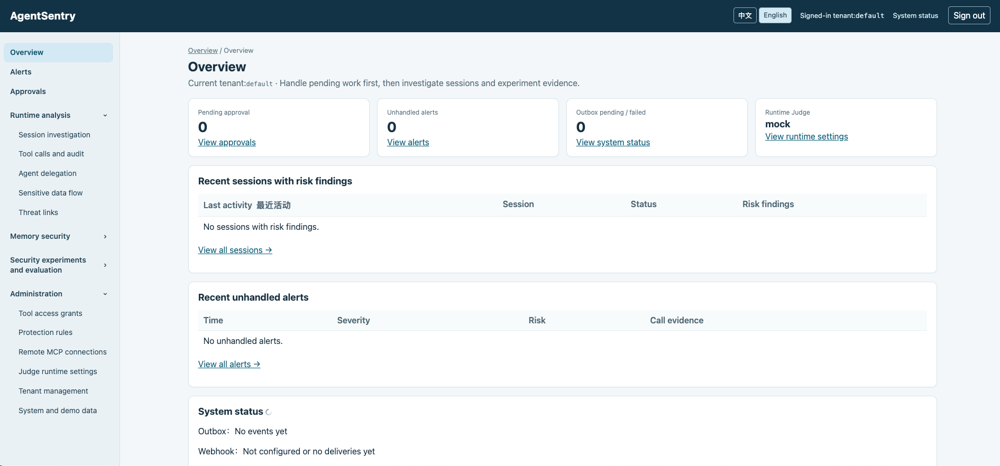

# AgentSentry

[English](#) · [中文](README.zh-CN.md)

### Make Agent security visible, runnable, and testable.

**A self-hosted Agent security learning lab.** Explore how tool authorization, prompt injection, output and memory contamination, sensitive data flow, MCP supply chains, failure recovery, and Agent delegation work together. Run experiments and inspect both the protection and its limits.

Follow a complete evidence chain:

**Attack input → Agent behavior → Security decision → Actual effects and displayed answer → Audit evidence → Fix and retest**

[Start learning](docs/en/learning/README.md) · [Quick start](#quick-start) · [Advanced cases](docs/en/cases/README.md) · [Architecture](docs/en/architecture.md) · [Project plan](PROJECT-PLAN.en.md)

**15 security topics · 12 advanced cases · Scripted and live-model experiments · Chinese and English dashboard**

## See the platform



Investigate sessions, approvals, alerts, memory, data flow, and experiments in one dashboard. Follow linked records to the actual call and security decision. A fresh installation starts with your own empty database; runners generate new experiment records.

## Why AgentSentry exists

When an Agent can read materials, use tools, retain memories, and delegate work, security spans several boundaries:

- Can instructions embedded in a document make it act beyond the user's task?
- Can the answer remain contaminated after a dangerous tool call was blocked?
- Can an untrusted memory affect a later, otherwise normal task?
- Can the client detect changes in an MCP service's definitions or behavior?
- Can concurrent approval, revocation, and retries execute an unauthorized action?

AgentSentry turns these questions into **readable code, runnable experiments, and evidence you can inspect**. Its goal is to help learners understand where controls operate, how they combine, when they fail, and what tradeoffs they introduce.

### What makes it useful for learning

| Value | What you can do |
| --- | --- |
| Follow the whole runtime path | Trace identity and proposals through authorization, approval, execution, output checks, and audit records |
| Test your understanding | Predict normal and attack outcomes, replay fixed proposals, then observe a real model |
| Ground conclusions in facts | Separate dangerous attempts, actual tool effects, draft contamination, and displayed contamination |
| Study engineering challenges | Inspect atomic grants, concurrent approvals, idempotency, transactional Outbox, unknown results, and recovery |
| Learn from failures and fixes | Compare A03/A12 answer contamination, memory poisoning, and paraphrased private-number leakage with normal-task costs |
| Start small and go deeper | Basic tests and the first demo need no model key; add a local model and controlled MCP integrations later |

## Security capabilities

| Topic | Implemented mechanisms | Question to investigate |
| --- | --- | --- |
| Identity, authorization, approval | Tenant and Agent identities; time/use/resource-scoped grants; policy; original-action review and rechecks | Does a valid identity actually authorize this action? |
| Tool execution and MCP | Typed tools, restricted Docker sandbox, local stdio, registered remote HTTPS/OAuth MCP, fixed GitHub tools | How do you constrain resources and side effects after connecting? |
| Output and memory | Actual-source tracking, pre-display checks, memory review/quarantine/revocation, read checks and integrity seals | Can answers or future context remain contaminated? |
| Sensitive data flow | Source classification and checks at model, tool-write, answer, and memory exits | Where did sensitive content enter, and where could it leave? |
| Runtime behavior | Goal-drift hints, denial sequences, pause/resume, session and cross-session budgets | When do individually permitted calls become risky together? |
| Supply chain, failure, delegation | MCP profiles, change review, fixed probes, connection IP pinning, circuit breakers/backoff, attenuated single-hop delegation | How do dependency changes and collaboration affect boundaries? |
| Investigation and validation | Transactional audit, asynchronous Judge, alerts, OWASP/MITRE ATLAS links, experiments and calibration | What evidence supports a rule change or a claim of protection? |

See the [project plan](PROJECT-PLAN.en.md) and [risk evidence](docs/en/risk-coverage.md) for implementation and validation scope.

## Design principles

1. **Separate model proposals from authorized execution.** The model proposes calls, answers, and memory candidates. Trusted code holds credentials, binds sessions, checks safety, and records evidence. Credentials are not model messages.
2. **Check before acting, verify afterward.** Tool execution, model sending, answer display, and memory writing have corresponding checks. Approval freezes the original action and rechecks current state. A failed decision commit stops execution; unknown effects require independent reconciliation.
3. **Keep authorization and model analysis distinct.** Identity, parameters, resources, policy, data flow, and runtime state determine permission. Goal and semantic hints assist investigation. Judge analyzes received audit events asynchronously and cannot grant authority.
4. **Test attacks together with normal controls.** Scripted proposals test boundaries; real models test behavior. Reports retain normal completion, false blocks, failures, and inconclusive results. Humans review rule changes before regression and release.

## Architecture


[View the editable vector diagram](images/architecture-en.svg)

**The gateway decides; the trusted adapter sends approved model messages and displays approved output; tool backends execute authorized actions.** PostgreSQL retains linked evidence, Redis supports atomic grants, and asynchronous workers handle analysis and notifications.

Stack: **Python · FastAPI · PostgreSQL · Redis/Celery · Jinja2 · Docker Compose · Official Python MCP SDK**.

See the [architecture guide](docs/en/architecture.md) for trust boundaries, state transitions, failure behavior, and retention.

## What one learning exercise looks like

1. Read a public synthetic document and verify authorization, source, answer, and audit.
2. Replace it with a fixed malicious document and observe extra write attempts or attacker-specified answer text.
3. Inspect the original proposal, gateway decision, pre-approval effects, output check, and Judge signal.
4. Explain the stopping point, then test a legitimate quotation, unrelated task, or transformed payload.

**A blocked tool does not imply a clean draft; actual display must be verified separately.** The [A03/A12 case](docs/en/cases/injection-and-output.md) preserves pre/post-fix facts. The [private-data case](docs/en/cases/private-data-leakage.md) shows how conservative blocking protects an exit while obstructing normal tasks.

## Choose a learning path

| Goal | Entry |
| --- | --- |
| Run the project | [Quick start](#quick-start): first authorized call without a model |
| Learn systematically | [15-topic handbook](docs/en/learning/README.md) |
| Research an attack | [12 advanced cases](docs/en/cases/README.md) |
| Observe a real model | [Local model setup](docs/en/local-model.md), then [experiment index](docs/en/learning/experiment-index.md) |
| Investigate events | [Dashboard navigation](docs/en/web-dashboard.md), [risk evidence](docs/en/risk-coverage.md), [threat matrix](docs/en/threat-framework-mapping.md) |
| Assess your understanding | [Personal assessment](docs/en/learning/personal-assessment.md) and [record template](docs/en/learning/personal-assessment-template.md) |

Suitable for developers, security learners, and researchers who want to study protection and usability together. No development-history reading is required.

## Quick start

### Prerequisites

Docker/Compose for services; `uv` for the host Python environment; Python 3.11+ (security CI uses 3.12); an available loopback port, default `8000`. Run commands from the repository root using a POSIX shell. Native Windows has not been fully validated; Linux/macOS with Docker are the documented paths. Initial dependency/image downloads require network access.

**The first demo needs no model, cloud Judge, or GitHub key.** For offline-only learning, skip Docker and private `.env` creation and follow the [handbook environment](docs/en/learning/README.md#prerequisites-and-command-conventions).

### 1. Configure and start

For a new install; do not overwrite an existing `.env`:

```bash
cp .env.example .env
chmod 600 .env
uv sync --locked --extra test
```

Replace all `CHANGE_ME` values:

| Setting | Requirement |
| --- | --- |
| `POSTGRES_PASSWORD`, `DATABASE_URL` | Same database password in both; keep Compose hostname `db` |
| `ADMIN_PASSWORD` | Your default-tenant administrator password |
| `SESSION_SECRET`, `AGENT_API_KEY` | Separate random values, each at least 32 characters |
| `AGENTSENTRY_PORT` | `8000`, or another free port |

Generate each secret independently with `python3 -c "import secrets; print(secrets.token_urlsafe(40))"`. Keep initial Mock Judge and disabled external integration settings.

```bash
docker compose up --build -d
docker compose ps
curl --fail http://127.0.0.1:8000/ready
```

Open the [local dashboard](http://127.0.0.1:8000/dashboard), sign in with your `ADMIN_PASSWORD`, and select English. Replace `8000` in browser, curl, and `SENTRY_URL` examples if changed. Raw tasks, sources, and evidence retain their original language; see [language behavior](docs/en/web-language.md).

### 2. Make your first safe call

In **Administration → Tool access grants**, issue a short-lived, limited-use grant for Agent `demo-agent`, tool `read_document`, resource `public-guide`. Save the one-time token only in your trusted terminal.

The demo Agent does not automatically load `.env`; set actual values in its process environment:

```bash
export AGENT_API_KEY='YOUR_AGENT_KEY'
export SENTRY_URL='http://127.0.0.1:8000'
export AGENT_CAPABILITIES_JSON='{"read_document":"YOUR_ISSUED_TOKEN"}'
.venv/bin/agentsentry-demo --scenario read-public
```

Expect a public synthetic document. This fixed demo makes no real model request and generates no memory, but its displayed result still passes gateway output checks. Follow the session and call under **Runtime analysis → Session investigation** and **Tool calls and audit**. Judge is asynchronous; inspect Outbox while waiting.

Offline test databases are not imported into the dashboard. Use an online runner and its research tenant to generate your own visible experiment data.

### Optional model and shutdown

After the fixed demo, follow [local model setup](docs/en/local-model.md), match the sending process to the registered destination, then use `--scenario llm`. The model must support the required OpenAI-compatible interface and tool calls; a Judge key is not an Agent model key.

```bash
docker compose down
```

This preserves named volumes. Adding `--volumes` deletes database, policies, and demo storage. Exclude `.env`, `.local/`, databases, and private records when sharing a directory.

## Integrations and configuration

| Topic | Guide and boundary |
| --- | --- |
| Tenants | [Onboarding](docs/en/tenant-demo.md); one-time credentials, own `AGENT_TENANT_ID`/key; shared Shell only for default |
| Local MCP | [Setup](docs/en/local-mcp.md), [boundary case](docs/en/cases/mcp-boundaries.md); fixed stdio definitions |
| Remote MCP | [HTTPS/OAuth](docs/en/remote-mcp.md), [profiles and changes](docs/en/mcp-supply.md); third-party OAuth interoperability remains unverified |
| GitHub MCP | [Read](docs/en/cases/github-readonly.md), [Issue analysis](docs/en/cases/github-issue-analysis.md), [controlled write](docs/en/cases/github-controlled-write.md); writes require a separate PAT and human review |
| Output and memory | [Output](docs/en/output-safety.md), [memory](docs/en/memory.md), [integrity](docs/en/memory-integrity.md) |
| Runtime and data flow | [Sessions](docs/en/runtime-analysis.md), [rules](docs/en/runtime-defense.md), [data flow](docs/en/data-flow.md), [goals](docs/en/goal-drift.md), [budgets](docs/en/action-chain.md) |
| Delegation and failure | [Single-hop protocol](docs/en/delegation.md), [recovery](docs/en/fault-propagation.md) |
| Research and evidence | [Attack lab](docs/en/attack-lab.md), [calibration](docs/en/calibration.md), [matrix](docs/en/threat-framework-mapping.md), [event mapping](docs/en/runtime-threat-mapping.md) |

For an existing local MCP installation, preview `.venv/bin/python scripts/enable_mcp_policy.py`, then explicitly use `--apply`. Run `.venv/bin/python scripts/mcp_demo.py` for a read, or add `--write` to request approval. Existing tenant policy is not silently expanded.

`send_external` writes a simulated local inbox. `github_mcp_create_test_issue` creates a real GitHub Issue. For unknown writes, reconcile the original action before any retry.

### Judge and privacy

`JUDGE_PROVIDER=mock` initializes new tenants. Existing tenants select a configured provider in **Administration → Judge runtime settings**; event retries keep their original route. The sample-page choice affects new sample evaluations only.

| Provider/function | Settings |
| --- | --- |
| Mock | No key; deterministic development signals |
| OpenAI-compatible Judge | `JUDGE_OPENAI_BASE_URL`, `JUDGE_OPENAI_MODEL`, optional `JUDGE_OPENAI_API_KEY` |
| Jev hosted API | `JEV_API_KEY`, `JEV_BASE_URL`, `JEV_MODEL`; default `https://api.typesafe.ai` |
| DeepSeek | `DEEPSEEK_API_KEY`, `DEEPSEEK_BASE_URL`, `DEEPSEEK_MODEL`; default `https://api.deepseek.com` |
| Local hints | `OUTPUT_LOCAL_MODEL_BASE_URL`/`OUTPUT_LOCAL_MODEL_NAME`, `GOAL_LOCAL_MODEL_BASE_URL`/`GOAL_LOCAL_MODEL_NAME`; disabled by default |
| Alert aggregation | `ALERT_COOLDOWN_SECONDS` |
| Judge Webhook | HTTPS `WEBHOOK_URL`, `WEBHOOK_SECRET` of at least 32 characters; recipient deduplicates stable keys |

A Judge score describes the received event, not attack probability. It cannot miss an answer it never received. Cloud evaluations may cost money; new core audit events minimize content, while older events and synthetic samples may follow redacted-text projection rules.

- `AGENTSENTRY_CAPTURE_MODE=preview` saves bounded redacted excerpts. `metadata` omits task/answer excerpts but still submits original text temporarily for gateway checks.
- `AGENTSENTRY_MEMORY_ENABLED=true` defaults on. **Both modes store long-term memory text.** Disabling stops future reads/writes without deleting existing memory.
- `AGENTSENTRY_RUNTIME_BINDING_REQUIRED=false` is compatibility mode; unbound tool calls have no action-budget protection. Require binding only after adapting all callers.
- Completed new operations with a data-flow decision clear text after 30 days from creation. Pending, unknown, and older records without that decision are retained separately.

See the [retention table](docs/en/architecture.md#data-retention-and-privacy). Masking, redaction, expiration, and deletion are distinct; none implies whole-database encryption.

## Regression checks

Use a separate terminal configured with the [offline conventions](docs/en/learning/README.md#prerequisites-and-command-conventions):

```bash
.venv/bin/python -m pytest -q
.venv/bin/python -m agentsentry.evaluation --policy policies/default.yaml --cases evals/cases.jsonl --output /tmp/agentsentry-eval.json
.venv/bin/python -m agentsentry.policy_tests --policy policies/default.yaml --cases policy-tests/cases.yaml
.venv/bin/python scripts/check_threat_mapping.py --check
.venv/bin/python scripts/check_learning_assessment.py --check
.venv/bin/python scripts/check_english_docs.py --check
.venv/bin/python scripts/check_mcp_supply_chain.py
```

Tests use temporary data, stubs, and some local subprocess/loopback services; no real model key is required. Real models, sandbox drills, and third-party paths need separate observations. The [CI workflow](.github/workflows/security.yml) defines offline checks; its existence is not evidence of a successful GitHub run.

`recovery_drill.py` stops/restores Worker; `v15_smoke.py` changes/restores policy; `cloud_judge_check.py` requests configured Judge services and may cost money. These are advanced operations described in the experiment index.

## Learn and contribute together

Reproduce a case, add a normal control, investigate an untested boundary, or improve explanations and translations. Share expected versus actual results, versions, and scope; failures and inconclusive outcomes are useful evidence.

Read [contributing](CONTRIBUTING.en.md), use synthetic data, and exclude credentials and raw business traces. Follow the [research directions](PROJECT-PLAN.en.md#future-directions-and-completion-criteria), discuss in Issues, and contribute your own reproducible evidence.

## Scope

Baseline **V3.6**, documentation **2026-10-01**. A local learning/research lab with synthetic data and registered tools; not a production guarantee.

Only explicitly integrated paths are protected. Bound tool sessions receive action-budget checks. Semantic rewrites, long autonomous tasks, third-party drift, and multi-model cooperation remain incompletely validated. Optional cloud/model/MCP settings create external connections; GitHub writes are real.

[API index](docs/en/api-reference.md) · [Sharing/privacy](docs/en/public-sharing.md) · [Risk evidence](docs/en/risk-coverage.md)

No `LICENSE` is included yet; the maintainer must choose one to clarify use, modification, and distribution rights.
