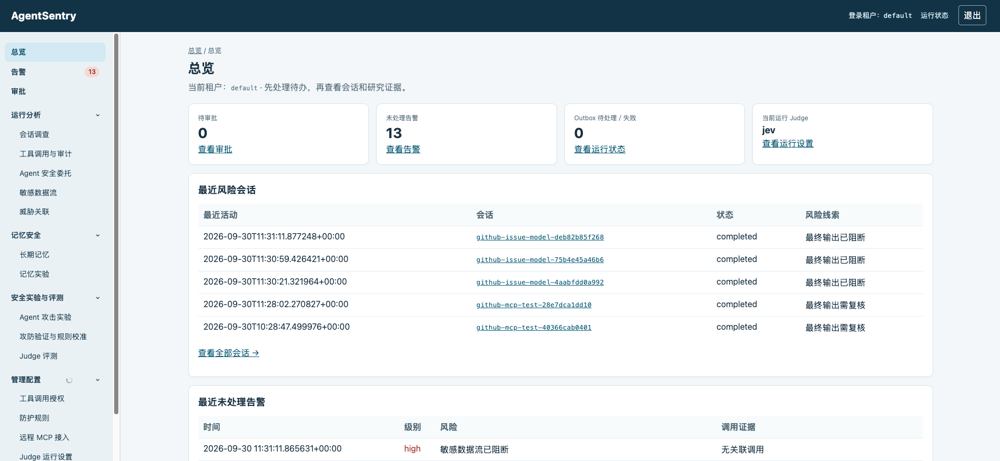
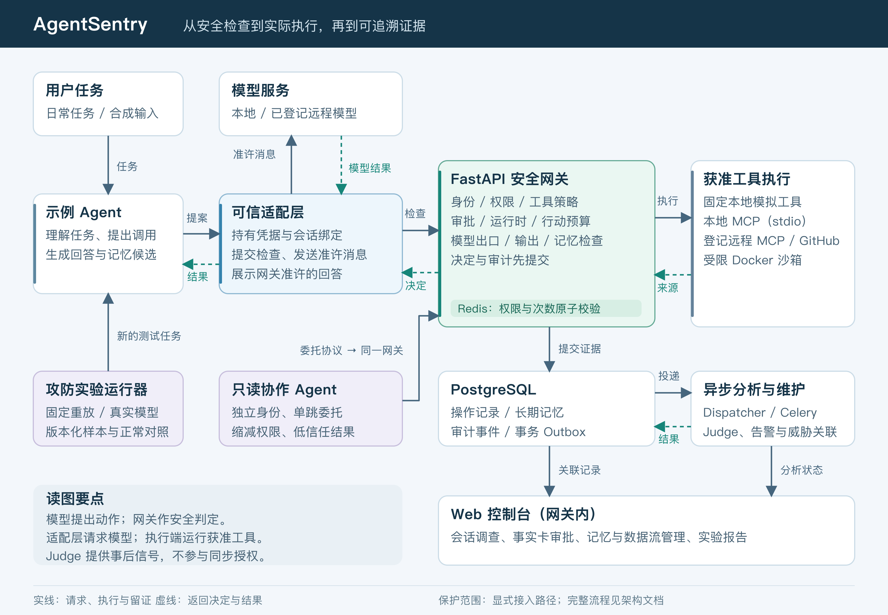

# AgentSentry

[中文](#) · [English](README.md)

### 把 Agent 安全变成看得见、跑得通、能验证的学习实践。

**一个本机自托管的 Agent 安全实验平台。** 从工具授权、提示词注入、输出与记忆污染，到敏感数据流、MCP 供应链、故障恢复和 Agent 间委托，在同一个项目里理解它们如何协作，并亲手验证防护的效果与边界。

你可以沿着一条完整链路，观察攻击从哪里进入、Agent 做了什么、安全网关如何决定，以及工具和回答最终发生了什么：

**攻击输入 → Agent 行为 → 安全决定 → 实际副作用／回答展示 → 审计证据 → 修复与复测**

[开始学习](docs/learning/README.md) · [快速启动](#快速启动) · [进阶案例](docs/cases/README.md) · [完整架构](docs/architecture.md) · [能力与边界](AgentSentry%20整体项目方案.md)

**15 个安全主题 · 12 个进阶案例 · 固定重放与真实模型双轨验证 · 独立中英文文档与 Web 面板**


## 先看看它能做什么



在一个面板中查看会话、审批、告警、记忆、敏感数据流与实验结果，并沿关联记录追溯到具体调用和安全决定。截图中的实验数据由运行器产生；新安装从自己的空白记录开始。

英文文档和英文界面截图见 [English README](README.md)；登录页和面板顶部可切换界面语言，来源材料与原始证据保留原文。

## 为什么做 AgentSentry

当 Agent 能够读取材料、调用工具、保存记忆并委托任务时，安全问题会跨越多个环节：

- 一段文档里的恶意指令，能否让 Agent 做出超出用户任务的动作？
- 工具被拒绝后，回答是否仍然可能被污染？
- 一条不可信记忆，会不会在下一次正常任务中继续影响模型？
- MCP 服务改变了定义或行为，接入方能否发现？
- 审批、吊销和重试发生竞争时，会不会执行不该执行的动作？

AgentSentry 把这些问题落实到**可阅读的代码、可运行的实验和可核对的证据**。项目目标是帮助学习者建立 Agent 安全的系统视角，理解每道控制的职责、组合方式、失效条件和取舍。

### 这个项目值得学习的地方

| 价值 | 你能实际做什么 |
| --- | --- |
| **沿完整运行链理解安全** | 从身份、工具提案追到网关决定、审批、执行、输出与审计，找到每道检查真正生效的位置 |
| **通过攻防实验验证理解** | 先预测正常与攻击结果，再运行固定样本；接入真实模型后，观察它是否真的被诱导 |
| **把安全结论落到事实** | 分别核对危险尝试、工具副作用、草稿污染与展示污染，避免只凭告警或 Judge 分数下结论 |
| **学习真实工程难点** | 研究原子权限扣减、并发审批、幂等、事务 Outbox、未知结果、熔断和恢复 |
| **从失败案例学习修复** | 阅读 A03／A12 回答污染、记忆投毒、私有数字改写泄露等案例，比较修复效果与正常任务代价 |
| **低门槛开始，逐步深入** | 基础测试与首次演示无需模型密钥；随后按需接入本地模型、MCP 和受控第三方服务 |

## 安全能力全景

| 安全主题 | 已实现的机制 | 可以深入的问题 |
| --- | --- | --- |
| **身份、权限与审批** | 租户与 Agent 身份、限时／限次资源授权、工具策略、原参数事实卡和执行前复核 | 怎样让“身份有效”与“这次动作被授权”分别成立？ |
| **工具执行与 MCP 接入** | 固定类型化工具、受限 Docker 沙箱、本地 stdio、登记的远程 HTTPS／OAuth MCP、GitHub 固定工具 | 协议接通之后，如何限制工具、资源和副作用？ |
| **输出与跨会话记忆** | 实际来源关联、展示前检查、记忆审核／隔离／撤销、读取再检与存储完整性 | 工具没越权时，回答和后续上下文是否仍受污染？ |
| **敏感数据流** | 来源分级，模型发送、工具写入、回答展示与记忆保存四类出口检查 | 敏感信息从哪里进入，又可能流向哪里？ |
| **运行时行为** | 目标偏移辅助线索、连续拒绝检测、暂停／恢复、会话与跨会话行动预算 | 单次合法动作，连续发生时是否形成风险？ |
| **供应链、故障与委托** | MCP 档案与变更审核、固定行为探针、连接 IP 固定、熔断／退避、单跳只读委托与权限缩减 | 依赖变化、服务故障与协作如何影响安全边界？ |
| **分析与攻防验证** | 事务审计、异步 Judge、告警、OWASP／MITRE ATLAS 映射、双轨实验与规则校准 | 怎样用证据判断效果、发现误拦，并决定是否修改规则？ |

每项能力的实现程度、测试证据与适用范围见[当前总纲](AgentSentry%20整体项目方案.md)和[风险覆盖](docs/risk-coverage.md)。

## 项目的核心思路

### 1. 把模型提案与安全执行分开

模型负责理解任务、提出调用、生成回答和记忆候选；**可信适配层和安全网关**负责身份、授权、同步检查及证据。凭据由可信代码持有，不作为模型消息。

### 2. 在动作发生前检查，在发生后核对

工具执行、模型发送、回答展示和记忆写入都有相应检查。审批冻结原动作，批准后还要重查当前权限和状态；安全决定提交失败时停止。执行结果不明保留 `unknown`，先核对副作用再处理。

### 3. 让确定性控制与模型分析各司其职

资源授权、参数、策略、数据流与运行状态决定能否执行。目标偏移和可选语义分析提供调查线索；异步 Judge 分析收到的审计事件，帮助发现问题，不能扩大权限或替代同步授权。

### 4. 把攻防研究与正常对照一起做

固定提案验证安全边界，真实模型实验观察 Agent 行为。报告同时记录攻击效果、正常任务完成、误拦和无法判定项；规则改动通过人工审查与回归生效。日常会话供调查，实验运行器发起新的合成测试。

## 整体架构



[查看高清矢量图](images/architecture.svg)

**网关作安全判定；可信适配层实际发送模型请求、展示回答；工具端执行获准动作。** PostgreSQL 保留关联证据，Redis 支持原子权限检查，异步 Worker 承担分析与通知。

技术栈：**Python · FastAPI · PostgreSQL · Redis / Celery · Jinja2 · Docker Compose · 官方 Python MCP SDK**。

更完整的信任边界、审批流程、状态机、故障行为与数据留存见[架构文档](docs/architecture.md)。

## 一次学习可以怎样展开

以“读取文档后概述”为例：

1. **建立正常对照**：让 Agent 读取公开合成文档，核对授权、来源、回答和审计。
2. **加入固定攻击**：换成带恶意指令的材料，观察模型是否提出额外写入，或把指定文字写进回答。
3. **沿证据追踪**：在面板查看原提案、网关决定、审批前副作用、输出检查和 Judge 信号。
4. **研究修复与取舍**：解释攻击在哪一层被阻断；再测试正常引用、无关任务及变形载荷。

一个真实的学习重点是：**危险工具没有执行，回答草稿仍可能受污染；展示前检查是否阻断，必须单独验证。** [A03／A12 案例](docs/cases/injection-and-output.md)保留了这类问题的修复前后事实。[私有数据泄露案例](docs/cases/private-data-leakage.md)则展示了保守阻断如何保护出口，同时影响正常任务。

## 选择你的学习路线

| 你想做什么 | 从哪里开始 |
| --- | --- |
| 先跑通项目 | [快速启动](#快速启动)：无需真实模型，完成一次安全调用 |
| 系统学习机制 | [15 章安全学习手册](docs/learning/README.md)：按主题阅读代码、预测结果并动手 |
| 直接研究某类攻击 | [12 个进阶案例](docs/cases/README.md)：问题、控制、前后证据与局限 |
| 观察真实模型行为 | [本地模型配置](docs/local-model.md) → [实验索引](docs/learning/experiment-index.md) |
| 调查安全事件 | [Web 导航](docs/web-dashboard.md) → [风险证据](docs/risk-coverage.md)与[威胁矩阵](docs/threat-framework-mapping.md) |
| 检验自己是否学会 | [个人学习验收](docs/learning/personal-assessment.md)、[记录模板](docs/learning/personal-assessment-template.md) |

适合希望理解 Agent 安全的开发者、希望动手验证威胁的安全学习者，以及研究防护效果与取舍的同伴。学习手册以威胁、控制、实验和证据为主线，无需先了解项目开发历史。

## 快速启动

### 前置条件

- Docker 与 Docker Compose 可用，用于运行基础服务。
- `uv` 可用，用于创建本机 Python 环境；项目要求 Python 3.11 及以上，安全 CI 使用 3.12。
- 一个可用的回环端口，示例默认为 `8000`。

命令在项目根目录执行，采用 POSIX shell 写法。原生 Windows 未作完整验收；可在支持 Docker 的 Linux／macOS 环境学习。首次下载依赖和容器镜像需要联网。**第一次演示不需要模型、云 Judge 或 GitHub 密钥。** 仅做离线学习时只需 Python 测试环境，可以跳过 Docker 与 `.env` 创建，直接按手册设置离线终端。

### 1. 配置与启动

新安装执行；已有 `.env` 不覆盖：

```bash
cp .env.example .env
chmod 600 .env
uv sync --locked --extra test
```

编辑 `.env`，替换全部 `CHANGE_ME`：

| 配置 | 设置要求 |
| --- | --- |
| `POSTGRES_PASSWORD`、`DATABASE_URL` | 两处数据库密码一致；Compose 中数据库主机保持 `db` |
| `ADMIN_PASSWORD` | 自己的管理员密码，用于默认租户登录 |
| `SESSION_SECRET`、`AGENT_API_KEY` | 分别生成独立随机值，至少 32 字符 |
| `AGENTSENTRY_PORT` | 默认 `8000`；端口冲突时换一个空闲端口 |

可分别用 `python3 -c "import secrets; print(secrets.token_urlsafe(40))"` 生成随机值。保持 Mock Judge、远程 MCP、GitHub 和 Webhook 的初始设置；无需为基础学习启用外部服务。

```bash
docker compose up --build -d
docker compose ps
curl --fail http://127.0.0.1:8000/ready
```

如已换端口，同时替换所有浏览器、curl 和 `SENTRY_URL` 示例中的 `8000`。访问 [本机面板](http://127.0.0.1:8000/dashboard)，使用自己设置的 `ADMIN_PASSWORD` 登录。右上角可切换中文／English；任务、来源、记忆和原始证据保留原文，详见[界面语言说明](docs/web-language.md)。

### 2. 完成第一次安全调用

在“管理配置 → 工具调用授权”签发：Agent `demo-agent`、工具 `read_document`、资源 `public-guide`，选择短有效期与有限次数。保存一次性显示的令牌到自己的终端环境，勿写入代码或报告。

示例 Agent 不自动读取 `.env`。在**运行 Agent 的终端**设置实际值，替换下面的占位符：

```bash
export AGENT_API_KEY='替换为自己的 Agent 密钥'
export SENTRY_URL='http://127.0.0.1:8000'
export AGENT_CAPABILITIES_JSON='{"read_document":"替换为本轮签发的令牌"}'
.venv/bin/agentsentry-demo --scenario read-public
```

预期得到公开合成文档；固定演示不请求真实模型、不生成长期记忆，展示仍经网关检查。在“运行分析 → 会话调查”和“运行分析 → 工具调用与审计”查看本轮会话、调用、来源、输出检查及审计。Judge 异步执行，尚无结果时先看 Outbox 状态。

新安装不包含原作者的实验数据库。离线测试也不会自动出现在 Web 中；要生成实验页面数据，按[实验索引](docs/learning/experiment-index.md)选择在线运行器和对应研究租户。

### 运行真实本地模型

这是可选进阶步骤。先完成固定演示，再按[本地模型配置](docs/local-model.md)核对**实际发送请求的进程**与网关登记地址，然后运行 `--scenario llm`。模型必须已安装并支持所需的 OpenAI 兼容接口和工具调用。Judge 密钥不充当 Agent 模型密钥。

### 停止与保留

```bash
docker compose down
```

此命令停止服务并保留命名卷。不要为普通重启加 `--volumes`：那会删除数据库、租户策略和演示存储。`.env`、`.local/`、数据库和个人学习记录均不属于公开文件；直接打包文件夹时也须排除，见[公开分享说明](docs/public-sharing.md)。

## 接入、隔离与专题说明


| 主题 | 入口与边界 |
| --- | --- |
| 多租户 | [租户接入](docs/tenant-demo.md)；新租户管理员密码和 Agent 密钥只显示一次，Agent 设置 `AGENT_TENANT_ID` 与自己的 `AGENT_API_KEY`；共享 Shell 仅供默认租户 |
| 本地 MCP | [接入说明](docs/local-mcp.md)、[边界案例](docs/cases/mcp-boundaries.md)；固定 stdio 定义，不透传新增工具 |
| 远程 HTTPS／OAuth MCP | [配置与受控演示](docs/remote-mcp.md)、[接入档案与变更检测](docs/mcp-supply.md)；登记按租户隔离，第三方通用 OAuth 互通仍需实测 |
| GitHub 官方 MCP | [只读实测](docs/cases/github-readonly.md)、[公开 Issue 实验](docs/cases/github-issue-analysis.md)、[测试仓库受控写入](docs/cases/github-controlled-write.md)；写入是实际外部副作用，须独立 PAT 与人工事实卡审批 |
| 输出与记忆 | [输出检查](docs/output-safety.md)、[记忆](docs/memory.md)、[存储完整性](docs/memory-integrity.md) |
| 日常分析与同步处置 | [会话采集](docs/runtime-analysis.md)、[运行时安全规则](docs/runtime-defense.md)、[敏感数据流](docs/data-flow.md) |
| 目标与连续动作 | [目标偏移](docs/goal-drift.md)、[会话行动链](docs/action-chain.md) |
| Agent 间委托 | [本机单跳只读接入](docs/delegation.md)、[委托案例](docs/cases/delegation-boundaries.md)、[学习章节](docs/learning/15-delegation.md)；独立身份、缩减权限、封签及低信任结果 |
| 攻防实验 | [攻击实验](docs/attack-lab.md)、[规则校准](docs/calibration.md)；命令行发起独立实验，日常流量不自动重放 |
| 威胁映射 | [静态证据矩阵](docs/threat-framework-mapping.md)、[日常事件关联](docs/runtime-threat-mapping.md)；关联线索不证明攻击成功 |

已有安装启用本地 MCP 时，先用 `.venv/bin/python scripts/enable_mcp_policy.py` 预览策略，再显式使用 `--apply` 启用。运行 `.venv/bin/python scripts/mcp_demo.py` 做读取；添加 `--write` 发起本地笔记审批。已有租户策略不会自动放行新增工具。

`send_external` 只写本地数据库模拟收件箱。`github_mcp_create_test_issue` 会创建真实 GitHub Issue，两者不能混同。远程写入结果 unknown 时，先核对上游副作用，不自动用新 ID 重试。

## Judge、告警与隐私配置


`JUDGE_PROVIDER=mock` 是新租户运行设置的初始值。已有租户从“管理配置 → Judge 运行设置”选择提供方；重启不会覆盖该租户选择，已提交事件重试保持原路由。Judge 样本页的提供方选择只影响新样本评测，不修改日常设置。

| 提供方／功能 | 配置入口 |
| --- | --- |
| Mock | 无密钥的固定离线开发模式，结果不代表真实模型效果 |
| OpenAI 兼容 Judge | `JUDGE_OPENAI_BASE_URL`、`JUDGE_OPENAI_MODEL`、可选 `JUDGE_OPENAI_API_KEY` |
| Jev | `JEV_API_KEY`、`JEV_BASE_URL`、`JEV_MODEL`；当前默认托管 TypeSafe API `https://api.typesafe.ai` |
| DeepSeek | `DEEPSEEK_API_KEY`、`DEEPSEEK_BASE_URL`、`DEEPSEEK_MODEL`；当前默认地址 `https://api.deepseek.com` |
| 可选本地辅助提示 | `OUTPUT_LOCAL_MODEL_BASE_URL`／`OUTPUT_LOCAL_MODEL_NAME`、`GOAL_LOCAL_MODEL_BASE_URL`／`GOAL_LOCAL_MODEL_NAME`；默认关闭，只作提示 |
| Judge 告警归并 | `ALERT_COOLDOWN_SECONDS`；保存重复次数 |
| Judge Webhook | `WEBHOOK_URL` 为 HTTPS，`WEBHOOK_SECRET` 至少 32 字符；未设置时关闭，签名与稳定幂等标识要求接收方去重 |

Judge 分数只评价它实际收到的单条事件。样本页显示所选提供方最新完成评测的混淆矩阵；没有收到最终回答就不能把回答污染计为 Judge 漏报。云端评测可能计费；新核心审计使用最小化元数据，历史事件与合成样本的公开片段仍可能按适配器规则脱敏后发送。

关键隐私与兼容配置：

- `AGENTSENTRY_CAPTURE_MODE=preview` 是示例 Agent 缺省采集模式，保存受限脱敏片段；`metadata` 不保存任务／回答片段，**原文仍临时进入网关检查**。
- `AGENTSENTRY_MEMORY_ENABLED=true` 默认开启，**preview 和 metadata 都保存长期记忆文字**；false 停止后续读写，不自动删除历史内容。
- `AGENTSENTRY_RUNTIME_BINDING_REQUIRED=false` 默认兼容旧客户端；未绑定工具请求不受行动链预算保护。全部调用方完成接入后才考虑开启强制绑定。
- 有数据流决定且已结束的新工具操作记录按创建时间超过 30 天后清原文，历史无该决定的记录、待审批和 unknown 暂留；并非全库自动删除。

完整留存规则见[架构说明](docs/architecture.md#数据留存与隐私)。面板遮盖、脱敏、过期与清除是不同动作，均不等于数据库全面加密。

## 回归检查

先在单独终端按[学习手册的离线环境约定](docs/learning/README.md#前置条件与命令约定)设置临时策略和关闭外部接入，再执行：

```bash
.venv/bin/python -m pytest -q
.venv/bin/python -m agentsentry.evaluation --policy policies/default.yaml --cases evals/cases.jsonl --output /tmp/agentsentry-eval.json
.venv/bin/python -m agentsentry.policy_tests --policy policies/default.yaml --cases policy-tests/cases.yaml
.venv/bin/python scripts/check_threat_mapping.py --check
.venv/bin/python scripts/check_learning_assessment.py --check
.venv/bin/python scripts/check_mcp_supply_chain.py
```

测试使用临时数据、替身及部分本机子进程／回环测试服务，不要求真实模型密钥。固定样本通过只证明注明边界；真实模型、沙箱现场和第三方接入须另行验证。[安全 CI](.github/workflows/security.yml)提供这些离线入口，工作流文件存在不代表已经在 GitHub 执行。

`scripts/recovery_drill.py` 会停止并恢复 Worker；`scripts/v15_smoke.py` 会修改并恢复策略；`scripts/cloud_judge_check.py` 会请求已配置的 Judge，可能计费。这些不是默认入门命令。现场实验的副作用、清理和结果位置见实验索引。

## 一起把 Agent 安全学得更扎实

欢迎一起复现实验、提出问题、补充正常对照与攻击变体，让每项安全结论都有更清晰的证据。

- **复现一个案例**：分享运行模式、样本／规则版本、预期与实际结果，失败和无法判定也有学习价值。
- **增加一个对照**：寻找被误拦的正常任务，说明安全与可用性的取舍。
- **深入一项边界**：研究公开来源语义改写、MCP 长期行为变化、故障传播或多 Agent 委托。
- **改善学习体验**：补充解释、图示、翻译与界面建议。

提交前阅读[贡献指南](CONTRIBUTING.md)，使用合成数据，不提交凭据或原始业务轨迹。后续重点见[研究方向](AgentSentry%20整体项目方案.md#五后续方向与完成标准)。如果这些问题也是你的关注点，欢迎关注项目、通过 Issue 讨论，并用自己的实验继续补充证据。

## 项目定位与边界

项目用于本机学习和研究，使用合成数据与固定登记工具；不作为生产安全保证。

- 保护范围是显式接入的 Agent 与固定路径；未透明拦截其他程序。行动预算只保护带有效会话绑定的工具请求。
- 测试通过只证明注明的样本和接入路径；语义改写、长期自主行为、第三方实现变化及多模型协作仍有未充分验证范围。
- 基础服务在本机运行；显式启用云模型、Judge 或第三方 MCP 会涉及实际外部连接。`send_external` 仅模拟外发，GitHub 写入会产生真实 Issue。
- `metadata` 不保存任务／回答片段，但原文仍临时进入网关检查；长期记忆和必要操作数据另有留存规则。

[接口索引](docs/api-reference.md) · [隐私与公开文件约定](docs/public-sharing.md) · [完整风险证据](docs/risk-coverage.md)

## 许可证

AgentSentry 采用 [MIT 许可证](LICENSE)。
