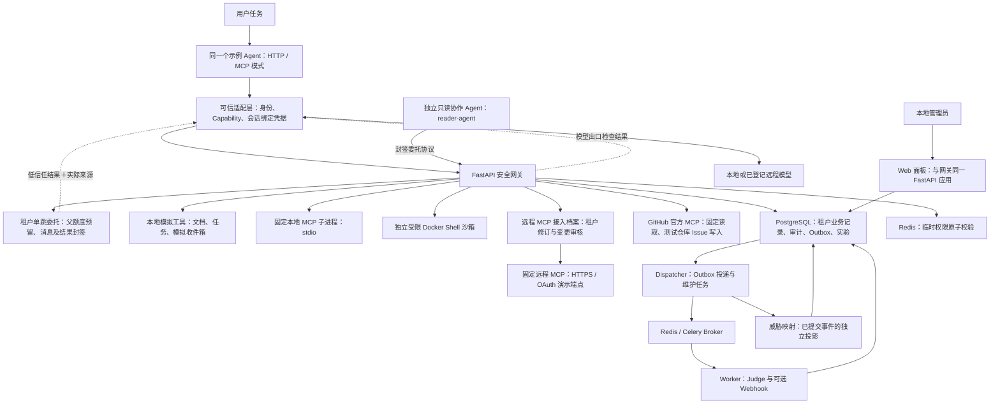
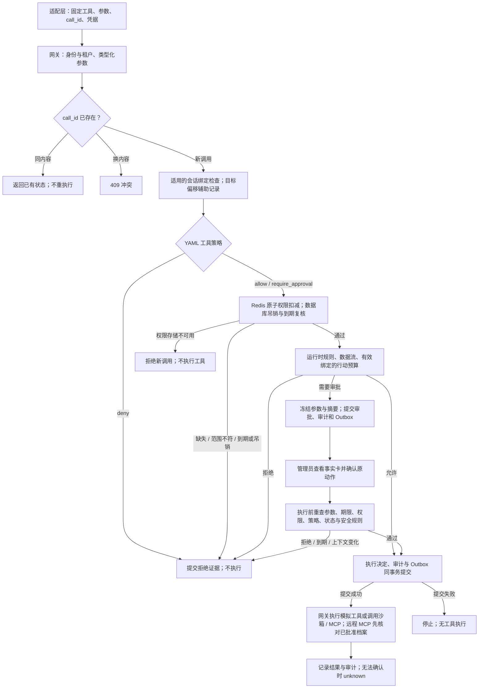
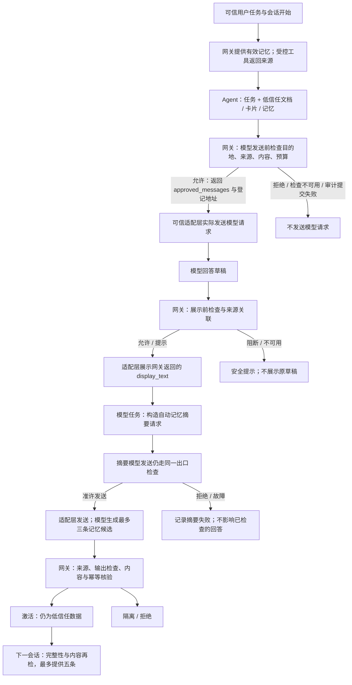
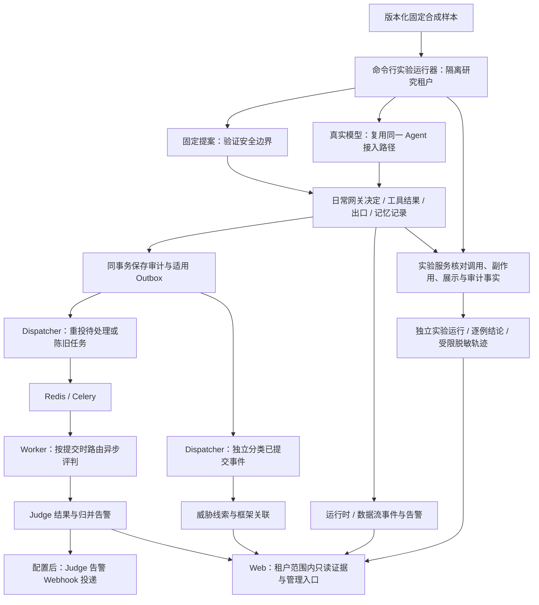

# AgentSentry 当前实现架构

[中文](#) · [English](en/architecture.md)

> 能力基线：V3.6；更新日期：2026-10-01。本文描述代码中的现有流程。功能状态见[当前总纲](../AgentSentry%20整体项目方案.md)，实验结论见[风险覆盖与证据](risk-coverage.md)。

## 组件与部署

| 组件 | 实际职责 | 部署与边界 |
| --- | --- | --- |
| 示例 Agent | 解释任务、提出工具调用、生成回答与记忆候选 | 本机进程；只有它的显式 HTTP／MCP 路径接入 |
| 可信适配层 | 附加身份与授权、持有会话凭据、提交模型与输出检查、使用准许内容发送／展示 | 可信代码；凭据不作为模型消息；MCP 入口只展示本地登记定义 |
| Web／网关 | 认证、授权、策略、审批、安全检查与管理员界面 | Compose 的 web 服务，唯一默认发布的端口为 `127.0.0.1:${AGENTSENTRY_PORT}:8000` |
| PostgreSQL | 操作数据、权限元数据、会话、记忆、审计、Outbox、Judge、告警与实验 | db 服务，不发布宿主端口；各租户 schema 共用数据库登录 |
| Redis | Capability 计数与 Celery 消息 Broker | redis 服务，不发布宿主端口；权限过期／耗尽后须重新签发 |
| Dispatcher | 重投 pending／陈旧任务、Webhook 投递调度、到期／留存维护、威胁投影 | 独立服务；维护循环依赖服务持续运行 |
| Worker | 按事件固定的提供方路由评判、保存结果与归并告警、Webhook 投递 | Celery 默认并发 1；Judge 不参与同步授权 |
| Shell 沙箱 | 执行原参数已获批的命令 | 独立 sandbox 服务，内部网络；默认租户专用 |
| MCP 工具端 | 执行登记的本地／远程工具 | 本地 Server 为网关启动的固定 stdio 子进程；remote-demo 为可选 Compose profile；GitHub 为真实外部服务 |
| 远程 MCP 接入档案 | 保存每租户已批准端点身份与工具定义摘要、变化候选和探针异常；管理员审核后生效 | 只覆盖固定 `remote-demo`；GitHub 固定工具摘要仍由代码管理；摘要不证明远端程序完整性 |

Compose 保留数据库、活动策略、本地 MCP 笔记和可选远程演示数据卷。沙箱没有宿主目录挂载，根目录只读，有临时空间、CPU／内存／进程限制、降权和逐命令 seccomp 网络限制。宿主机或容器运行时失陷不在已验证保证内；新租户禁止调用共享 `run_shell`。

## 工具调用与审批

### 判定与授权

- 租户选择在数据会话创建前完成。默认租户使用 `public`，新租户使用服务端生成的独立 schema；Agent、管理员与异步任务携带相应租户身份。
- 工具参数由固定 Pydantic 模型核验。资源提取器确定资源 ID；Agent 不能通过工具参数选择任意程序、上游工具或网络地址。
- YAML 决定优先级是 `deny > require_approval > allow`，未命中默认拒绝。正则只作为附加拒绝条件；精确资源授权由 Capability 承担。明确策略拒绝不消费令牌。
- Redis Lua 原子核对租户、Agent、工具、资源和剩余次数；TTL 控制缓存到期，PostgreSQL 授权元数据复核吊销与到期。非策略拒绝路径的后续安全检查可能发生在扣减之后，拒绝不保证返还次数。
- 工具调用用 `call_id` 保证幂等；同租户内相同 ID 换内容返回冲突。幂等避免本路径重执行，不保证不同 ID 或外部服务天然具有相同语义。
- `AGENTSENTRY_RUNTIME_BINDING_REQUIRED=false` 为兼容默认。行动预算只保护带有效会话绑定凭据的工具请求；敏感写入、远程 MCP、GitHub 和模型发送另有绑定要求。开启强制绑定是部署选择；本说明不自动改变现有配置。

### 审批与执行前复核

审批保存规范化参数摘要，期限不超过授权到期时间。Web 批准须先进入事实卡，再提交绑定管理员会话、租户、审批 ID、原参数及当前证据的短时确认；过期、重放或证据变化要求重新查看。拒绝可以直接处理。

普通管理员审批 API 继续要求登录和 CSRF；GitHub 写入只允许通过 Web 事实卡批准。批准后网关仍检查原参数、授权、当前策略、会话处置、数据流与适用的行动预算。新出现的敏感运行时线索可要求重新提交动作。来源文本中的“管理员已批准”没有授权效力。

### 调用状态与故障

| 状态 | 含义 | 后续行为 |
| --- | --- | --- |
| checking | 新调用在判定中，可能尚未提交 | 不视为执行证据 |
| denied | 策略、权限、安全规则、拒绝或到期使调用不执行 | 返回原决定 |
| pending_approval | 原参数已冻结，等待处理 | 无工具副作用；到期不获执行权限 |
| executing | 执行前决定已提交，正在调用工具 | 不自动启动同 ID 第二次执行 |
| completed | 已取得并提交工具成功结果 | 保留关联证据 |
| failed | 工具报告错误或发送前核验失败 | 按具体错误调查，不自动视为攻击 |
| unknown | 请求可能已经发出，或结果无法可靠提交 | 不推断成功或失败，不自动重试副作用 |

对于 `unknown`，管理员先核查上游真实副作用与原审批证据，再人工处理。GitHub 首笔写入曾因结果解析不兼容进入 unknown；只读回查后补记结果，原未知事件保留且没有再次写入，见[受控写入实测](cases/github-controlled-write.md)。

## 模型、回答与跨会话记忆

模型请求由适配层的统一发送函数执行，网关不是模型网络代理。适配层先调用 `POST /api/v2/runtime-sessions/{session_id}/model-egress/check`，只发送返回的准许消息与登记地址；身份、会话与模型服务密钥保留在可信代码中。模型请求 ID 换内容重试被拒。

来源分级依据实际读取记录和服务端目录：`public`、`private`、`secret`；未知来源按 private，明确凭据提升为 secret，来源自称“公开”不生效。敏感级别与指令可信度分别处理。本地模型允许 private，明确凭据仍阻断；远程模型只允许登记的 HTTPS 目的地，并阻断非公开来源和已识别个人信息。有限编码与规则匹配不能证明所有语义敏感信息均可检测。

输出检查核对会话任务指纹和实际来源，返回 `allow`、`warn`、`block` 及可展示文本。可选本地语义提示只产生复核线索；异步 Judge 不负责放行回答。A03／A12 的明确模式修复不证明任意改写已解决，见[A03](cases/injection-and-output.md)与[A12](cases/injection-and-output.md)。

模型任务完成且回答未被阻断后，示例 Agent 使用同一模型生成记忆候选；固定工具演示不生成记忆。网关检查 `session_id`、`output_check_id`、实际来源和写入请求 ID，按风险、来源审核及敏感级别决定激活、隔离或拒绝。私有来源先隔离，人工激活也不授予远程外发权限。

记忆默认 30 天过期，每 Agent 最多 100 条有效激活记忆，读取最多 5 条，按任务词与时间排序。读取时验证租户绑定签名、状态、期限和内容；隔离、撤销、过期或完整性异常的条目不返回。读取失败时本轮标记记忆不可用，不使用本地缓存绕过检查。撤销不能收回已进入进行中会话的内容；来源审核与签名不证明事实真实。

## 审计、Judge、告警与实验

执行前决定与待投递事件共用数据库事务；提交失败不执行受控动作。需要 Judge 的事件创建 Outbox，配置变更等部分管理事件仅记审计。Redis／Worker 故障不改变已提交的普通工具授权；审计积压与失败状态可见。未认证请求和非法参数可能尚未进入调用记录，不能把业务审计解释成所有网络请求的完整日志。

Dispatcher 重投 pending 及陈旧 queued／processing 项。Worker 对同一 Outbox 去重，保存至多一条 Judge 结果；提供方失败最多尝试三次，之后 failed 保留，未建设专用死信队列。默认并发 1 与提案预算不是完整平台限流或容量背压。

Judge 支持 Mock、OpenAI 兼容、Jev 托管 API 与 DeepSeek。租户运行设置确定新事件提供方，已提交事件及重试保持原路由。分数是单条事件的风险信号，不是攻击成功概率；只有达到条件的结果才生成日常 Judge 告警，不能据低分推断安全。

Judge 告警按指纹与冷却窗口归并，可选 HTTPS Webhook 使用 HMAC-SHA256、稳定 Idempotency-Key 和有限重试；接收方需去重。运行时／数据流告警与 Judge 告警并列展示，目前不使用同一 Judge Webhook 路径。真实外部 Webhook 投递仍没有对应验收报告。

日常威胁映射只分类已提交审计元数据中的明确规则命中，不由 Judge 标签直接推断攻击。框架映射用于调查；历史实验结论与日常事件线索分别保存。当前数据源和生成关系见[映射矩阵](threat-framework-mapping.md)。

实验从版本化样本库发起新测试；固定提案与真实模型分别判分。各运行器按自身规则创建或复用专用研究租户，保存逐例证据与报告。日常任务不会自动变成实验，也不从整个数据库重放。危险尝试、阻断、禁止副作用、草稿污染、实际展示污染、正常完成及无法判定分别统计；最终回答没有进入 Judge 时不能计为 Judge 漏报。

## 信任边界与故障行为

| 边界／故障 | 当前处理 | 不能推断的保证 |
| --- | --- | --- |
| 低信任材料与 Agent 指令 | 文档、卡片、结果和记忆作为数据；固定工具定义来自可信代码 | 不能证明模型永不服从间接指令 |
| 适配层与网关 | 认证、Capability、会话绑定、类型化参数与来源复核 | 不拦截独立程序、其他 Agent 的直连流量 |
| 管理员与租户 | 签名会话、CSRF、租户凭据；默认管理员可只读查看指定研究租户 | 研究视图不扩大写权限；共享进程失陷仍破坏边界 |
| Redis 权限存储不可用 | 新工具授权失败，不执行 | Broker 恢复不自动恢复已丢失的临时令牌 |
| 执行前数据库提交失败 | 不执行工具或模型发送 | 已发出的外部副作用无法依靠本地事务回滚 |
| 远程 MCP 发送前核验失败 | 记录失败，不发送目标工具调用；清单和端点变化保存审核候选 | 合成只读探针只检一个固定结果，清单哈希不证明远端程序或其他响应语义可信 |
| 发送后断连／超时或结果不明 | unknown，不自动重试副作用 | 不推断上游没有执行 |
| 输出检查不可用 | 不展示原草稿，显示固定提示 | 其他未接入展示路径不受保护 |
| 记忆摘要失败 | 记录失败，不影响已经检查的回答 | 不伪造记忆生成成功 |
| Judge 或可选辅助模型失败 | 保存失败／重试或辅助分析失败，沿用原同步控制 | 不把未知风险解释为安全 |
| 暂停、吊销与撤销 | 阻止符合条件的后续动作，审批执行前复核 | 不能收回已开始副作用或已进入模型的内容 |

通用远程 MCP 使用按租户登记的 HTTPS 地址与 OAuth；GitHub 使用单独固定适配器和只读／写入 PAT，当前限定默认租户。它们不是同一个通用认证机制。远程出口把核验后的 IP 固定到本次 TCP 连接，TLS 仍校验登记主机名；`remote-demo` 增加版本化档案和合成只读行为探针。真实 GitHub 链路已经实测，但真实公网 DNS 重绑定、通用 OAuth 跨主机互通及长期实现漂移仍未充分验证，见[远程接入说明](remote-mcp.md)、[供应链变更检测](mcp-supply.md)和[GitHub 写入案例](cases/github-controlled-write.md)。

## 数据留存与隐私

| 数据 | 当前保存内容 | 到期／清除行为 |
| --- | --- | --- |
| 会话与输出检查 | preview 保存受限脱敏任务、回答与草稿／展示片段；metadata 不保存这些片段。两者保存状态、指纹、来源、有限任务轮廓 | 没有统一的全部会话元数据或 preview 自动删除策略 |
| 模型发送／数据流决定 | ID、来源、目的地、级别、规则、处置与请求摘要 | 不保存检查请求原文；不等于所有上下文均不留存 |
| 工具操作记录 | 暂存规范化参数与结果，支持审批、幂等及来源核验；管理员页面默认遮盖 | 有数据流决定且为 completed／denied／failed 的调用，按创建时间超过 30 天后清原文；pending_approval、executing、unknown 先保留；历史无该决定的记录不自动迁移 |
| 记忆与来源审核 | 两种采集模式均保存长期记忆文字；审核记录保存来源 ID 与内容版本摘要 | 默认 30 天过期停止读取；清理或访问时，签名有效的 active／quarantined 过期条目转 expired 并清文字，完整性异常条目需另行处理；撤销不自动清文字，管理员可清除；关闭记忆开关只停止后续读写 |
| 新工具／出口／记忆／目标审计与 Outbox | 关联 ID、摘要、处置和有限风险标记 | 原文不进入这些新核心事件；没有全量审计统一 TTL |
| 历史事件与 Judge 样本 | 可能含旧版操作原文或合成评测内容 | 不迁移历史原文；适配器仍对允许的公开片段作脱敏投影，不能把所有历史／样本事件承诺为纯元数据 |
| 实验结果 | 样本版本、模型、结论、调用关联及受限长度脱敏轨迹 | 独立研究数据；不复制全部业务原文，不宣称轨迹脱敏能识别所有敏感信息 |
| 委托与协作结果 | 封签范围、父子关联、实际来源和经检查的摘要；metadata 也保存协作文字，页面默认遮盖 | 摘要 30 天清除文字，关联及审计保留；撤销不能收回已传递内容 |
| 凭据 | 环境中的服务密钥；权限缓存存令牌哈希；租户注册存身份凭据哈希 | 不进入模型消息或面板正文；本机 .env 与 .local 必须保护；没有因此实现数据库全面加密 |

`metadata` 不是“系统不保存任何会话衍生文字”。模型消息、来源和回答原文仍会临时到达本机网关；长期记忆和部分操作数据仍留存。Dispatcher 运行时才执行定期清理，清除正文也不等于删除备份。新核心事件最小化不能消除历史记录风险。

## 接口与代码导航

| 调用方 | 现有接口 | 作用 |
| --- | --- | --- |
| 可信适配层 | `POST /api/v1/tool-calls`、`GET /api/v1/tool-calls/{call_id}` | 提交／查询固定工具调用 |
| 可信适配层 | `PUT /api/v2/runtime-sessions/{session_id}/start`、`PUT /api/v2/runtime-sessions/{session_id}/finish` | 建立绑定、登记任务轮廓及结束状态 |
| 可信适配层 | `POST /api/v2/runtime-sessions/{session_id}/model-egress/check`、`POST /api/v2/runtime-sessions/{session_id}/output-check` | 发送前／展示前检查 |
| 可信适配层 | `POST /api/v2/runtime-sessions/{session_id}/memory/read`、`POST /api/v2/runtime-sessions/{session_id}/memory/write` | 读取与保存自身记忆；不暴露给模型作为工具 |
| 管理员 | `POST /api/v1/capabilities`、`DELETE /api/v1/capabilities/{grant_id}` | 签发／吊销工具授权 |
| 管理员 | `POST /api/v1/approvals/{approval_id}/decision` | 原动作审批；GitHub 写入须经事实卡 |
| 管理员 | `GET /api/v3/goal-assessments`、`GET /api/v3/action-chains`、`GET /api/v3/threat-mappings` | 查询辅助分析、预算与威胁证据 |

工具请求使用 `Authorization: Bearer`、`X-Tenant-ID`、`X-Capability` 和适用的 `X-Runtime-Session`。管理员写操作沿用登录与 CSRF；细节见 [README](api-reference.md)。

控制实现入口：[工具判定与审批](../src/agentsentry/service.py)、[模型数据流](../src/agentsentry/data_flow.py)、[输出](../src/agentsentry/output_safety.py)、[记忆](../src/agentsentry/memory.py)、[行动预算](../src/agentsentry/action_chain.py)、[Outbox 投递](../src/agentsentry/dispatcher.py)。所有效果结论须继续定位到[风险证据](risk-coverage.md)，不由图中出现组件推断全局防护。

## 故障隔离与安全恢复

故障处置在已经提交安全决定后、访问 MCP／沙箱前增加租户内熔断和执行租约；状态存 PostgreSQL。Judge 与 Webhook 采用独立队列及 Worker，Dispatcher 按租户和阶段隔离异常，指数退避并保留原 Outbox ID。每次处理使用新代次凭据，迟到结果不能覆盖新代次。`unknown` 不自动重试；管理员页面只允许重投终止的异步分析或通知。数据库、Redis 与主机仍是共用故障域，详见[故障处置表](fault-propagation.md)。

## Agent 间受限委托

现有父 Agent 通过有效会话与父 Capability 创建委托；网关原子预留父次数，在租户表保存不可变封签范围。独立 `reader-agent` 仅能领取单跳任务并调用两个公开合成读取工具。其请求复用原工具网关，不能使用普通工具、模型出口或记忆 API，不能写入或转委托。

子结果经输出安全及明显授权伪造检查，保存受限展示文字和结果封签。父领取时再次核对身份代次、父权限、期限、暂停、会话状态、结果完整性和原始来源级别。领取后，父来源包括实际子读取调用和独立委托回复；工具写入、模型发送和展示前检查仍按完整来源判定。不会把子调用伪造成父调用。详见[协议、留存与状态](delegation.md)。

协作摘要是受限操作数据，metadata 也暂存其文字；30 天清除文字，审计只含 ID 与处置。固定协作进程没有模型，本版不把委托来源写入长期记忆。API 身份隔离不构成同机进程的操作系统隔离；内容仍为低信任数据。
