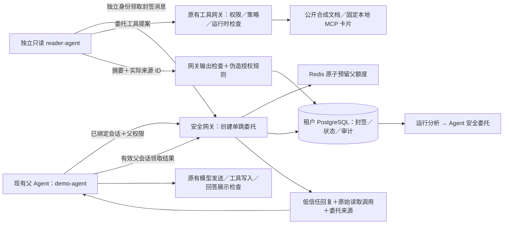

# Agent 间受限委托

[中文](#) · [English](en/delegation.md)


当前接入聚焦独立身份、权限缩减、消息完整性、调用预算和协作结果污染。保留现有 `demo-agent`，新增固定只读协作身份 `reader-agent`；后者没有模型出口和写入能力。这是两个身份和可分别运行的本机进程，不是通用多 Agent 编排平台。

## 实现架构



网关作判定；协作进程通过 HTTP 发出提案；文档工具或 MCP 才实际读取。协作进程不导入或调用工具实现，不直连 MCP。协议为项目自己的受限 HTTP 接入，未实现标准 A2A、跨主机或透明代理。

## 安全规则

| 机制 | 条件与处置 | 边界 |
|---|---|---|
| 独立身份 | 管理员经登录和 CSRF 创建协作密钥；请求须同时使用独立 Bearer 密钥与 `X-Agent-ID: reader-agent` | 身份头不是凭据；父密钥冒充协作身份、协作密钥冒充父身份均失败 |
| 权限缩减 | 父会话有效，已有权限的工具与资源涵盖子范围；只允许两个只读工具、最多 3 个公开资源 | 不允许自行注册 Agent、任意程序、远程服务、写入或转委托 |
| 额度继承 | Redis 原子预留 1～3 次，父剩余额度立即减少；SQL 记录子剩余额度 | 不是复制权限；撤销、过期或提交失败不退额度，避免重复分配；可重新由管理员授权 |
| 父行动预算 | 父直接调用数＋所有委托预留次数不得超过原 20 次会话预算 | 原工具预算不增加；来源接口上限增至 40，仅容纳原始调用及各委托回复 ID |
| 时效与撤销 | 最长 300 秒，不能超过父权限期限；每次操作重新核对父权限、父会话、父／子暂停、身份代次和委托状态 | 撤销影响后续决定，不能收回已经读取或已进入父上下文的内容 |
| 消息封签 | HMAC 绑定租户、父身份／会话、父权限 ID、子身份代次／会话、工具／范围、额度、期限、目的及深度 1 | 验证消息未被换内容，不证明材料和摘要真实；原始父令牌不进入封签消息 |
| 幂等 | 同委托请求 ID 同内容不重复预留；同调用 ID 同参数不重复读取；换内容冲突 | 摘要同内容重试返回原状态；已阻断／撤销不重新开启 |
| 结果复核 | 摘要最多 500 字，来源必须等于本委托实际已完成、已计费读取；先输出检查，再查伪造批准／系统指令等明显标记 | 规则可能误拦引用，可能漏检语义改写；没有声称“协作内容可信” |
| 结果完整性 | 保存的展示文字、来源列表和输出检查 ID 再封签；父领取时核对来源当前敏感级别 | 若资料重分类或回复被篡改则不传递；敏感上游结果不返回协作客户端 |
| 来源传递 | 父实际领取后关联原始子调用及独立 `delegation` 回复来源 | 不伪造父工具调用；父的模型请求／输出必须提供全部来源；转为私有的来源不能复用旧远程模型放行决定 |

`reader-agent` 只能使用委托协议；普通工具、模型发送、记忆、输出 API 和会话创建接口均拒绝。管理员仍能查看它的会话并暂停。固定协作进程从材料复制受限片段作摘要，摘要失败或被阻断时不会绕开网关。

来源接入与旧决定复核的规则版本更新为 `data-flow-rules-v4`、`output-rules-v6`；原来的私有回答阻断、凭据防护和工具权限要求继续有效。委托协议版本为 `delegation-rules-v1`。

## 数据与状态

新增四类租户表：`worker_principals`、`delegations`、`delegation_calls`、`delegation_lab_runs`。已有租户启动补建表，旧会话不补造委托。状态为 `created → running → completed / blocked`，管理员可撤销；定期清理标记超时为 `expired`。未完成／工具 `unknown` 时不能当成已完成摘要或自动重试。

委托摘要是受限操作数据，`metadata` 也保存通过检查的协作文字，30 天后清除文字，保留 ID、封签、关联和审计；页面默认遮盖。原有长期记忆的留存规则不变。本版委托来源不支持自动写入长期记忆，固定演示不生成记忆。新委托事件只存 ID、处置和规则版本，不投云端 Judge；原工具事件仍遵循既有元数据 Outbox／Judge 路径。未完成状态不伪造正常完成报告。

## 页面与接口

入口：**运行分析 → Agent 安全委托**，`/dashboard/delegations`。管理员可创建／轮换／停用协作身份，查看委托及独立会话、原始读取和审计，撤销当前委托；研究租户切换只读。密钥只展示一次，不显示在记录列表与日志中。

| 接口 | 身份 | 用途 |
|---|---|---|
| `POST /api/v3/delegation-workers/reader-agent/credential` | 管理员＋CSRF | 创建或轮换协作密钥，旧代次委托失效 |
| `POST /api/v3/delegation-workers/reader-agent/deactivate` | 管理员＋CSRF | 停用 |
| `POST /api/v3/delegations` | 父身份＋会话绑定＋父权限 | 创建缩减范围委托 |
| `GET /api/v3/delegations/inbox` | 协作身份 | 本租户待领取记录 |
| `POST /api/v3/delegations/{id}/claim` | 协作身份 | 获取封签及由网关建立的子会话 |
| `POST /api/v3/delegations/{id}/tool-calls` | 协作身份＋子会话绑定 | 按封签范围读取 |
| `POST /api/v3/delegations/{id}/complete` | 协作身份 | 提交受检摘要及实际来源 |
| `GET /api/v3/delegations/{id}/result` | 父身份＋父会话绑定 | 领取低信任结果并关联来源 |
| `POST /api/v3/delegations/{id}/revoke` | 管理员＋CSRF | 撤销 |

## 两个终端演示

安装命令后，先在界面为 `reader-agent` 创建独立凭据；再给父 Agent 的 `read_document` 或 `mcp_lookup_card` 授予 `public-guide` 的短时权限。两个进程各自使用对应环境，不将密钥写到命令参数或模型消息。示例中的值为占位符。

父终端沿用已有 `AGENT_API_KEY`、`AGENT_TENANT_ID`、`AGENT_CAPABILITIES_JSON` 和 `SENTRY_URL`：

```bash
uv run agentsentry-demo --scenario delegation
# 或固定本地 MCP：
uv run agentsentry-demo --scenario delegation --delegation-tool mcp_lookup_card
```

父终端显示委托 ID，等待最多 180 秒。协作终端设置自身环境后执行：

```bash
export AGENTSENTRY_READER_API_KEY='替换为独立协作凭据'
export AGENT_TENANT_ID='default'
export GATEWAY_URL='http://127.0.0.1:8000'
uv run agentsentry-reader '替换为父终端显示的委托 UUID'
```

首版客户端只连本机 HTTP 网关。父 Agent 不持有协作密钥；协作 Agent 不持有父密钥或父权限令牌。此演示使用固定提案，不启动真实模型、不对 GitHub 写入。

## 固定攻防实验

```bash
.venv/bin/python -m agentsentry.delegation_lab --report /tmp/agentsentry-delegation-report.json
docker compose exec -T web python -m agentsentry.delegation_lab --report /tmp/agentsentry-delegation-report.json --persist
```

26 条 `delegation-lab-v1` 样本：22 条边界攻击、4 条正常对照。每例独立临时 SQLite 数据库，MCP 使用固定结果替身；不修改日常策略、不停服务。`--persist` 只把脱敏结论存默认租户供页面展示；默认 Compose 的 db 主机名需在容器网络内解析，故使用上面的容器命令。真实 MCP 和 PostgreSQL 并发须另行现场验证，不能由替身通过推出。

机器判分分别检查拒绝依据、上游读取次数、禁止的工具副作用、完成调用的审计缺失和父输出检查。正常读取仍是副作用计数中的只读动作，不把所有调用都算成危险写入。

## 未覆盖范围

跨主机通信、通用委托策略、委托写入及审批继承、多跳链、不同模型协作、密钥托管、受损宿主直接访问工具、语义改写和内容真实性尚未验证。HMAC 的应用密钥与数据库同时失陷不在保护承诺内。框架场景 `TH-015`／ASI07 等为部分验证，不能解释成解决所有 Agent 间通信风险。具体已运行结果见[委托案例](cases/delegation-boundaries.md)。
