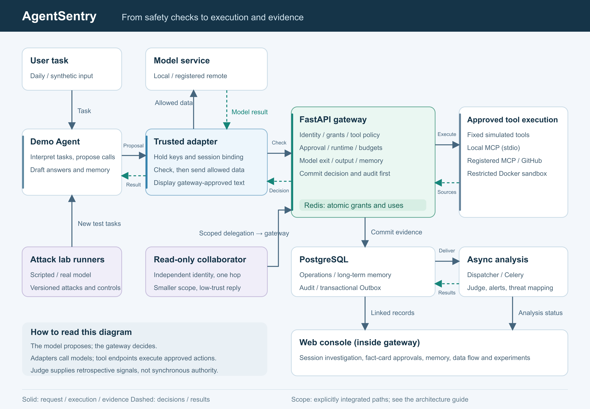
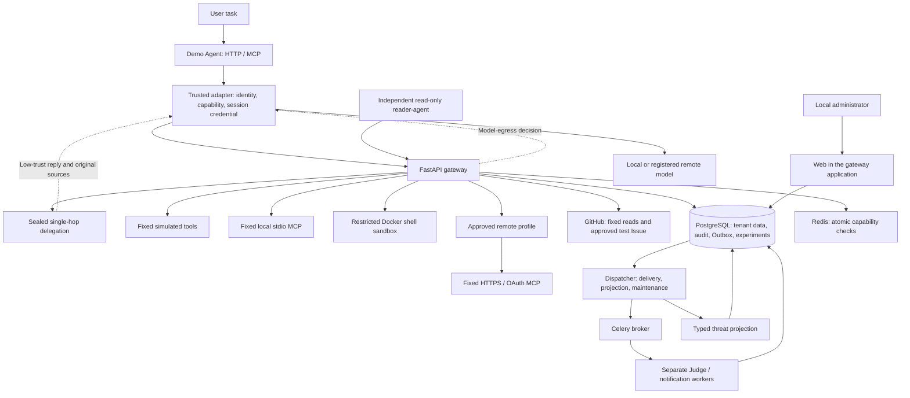
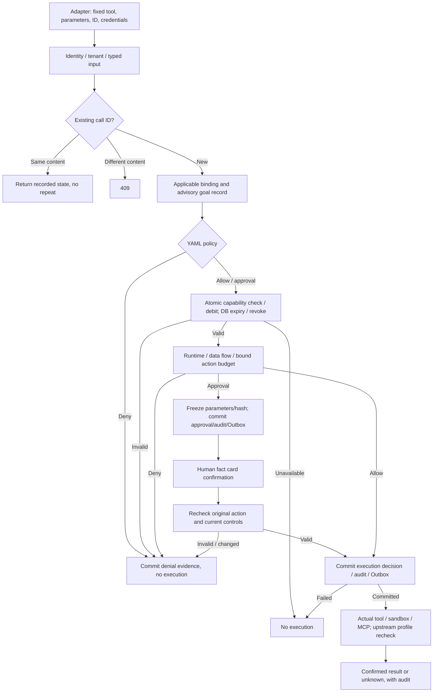
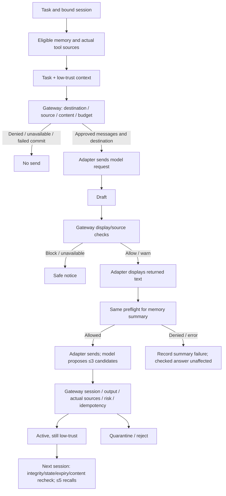
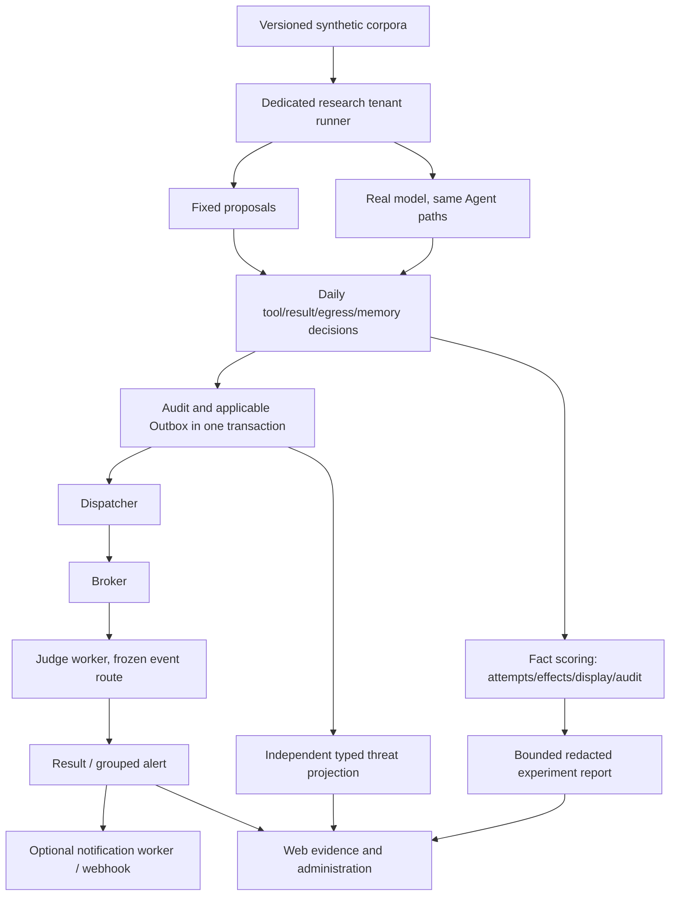

# AgentSentry: Current Implementation Architecture

[English](#) · [中文](../architecture.md)

Baseline: V3.6 · Updated: 2026-10-01. This describes implemented flows. Capability status is in the [project plan](../../PROJECT-PLAN.en.md); effect claims require [risk evidence](risk-coverage.md).

## Components and deployment

| Component | Responsibility | Deployment/boundary |
| --- | --- | --- |
| Demo Agent | Interpret task, propose tools/answer/memory | Explicitly integrated local HTTP/MCP process |
| Trusted adapter | Hold credentials, preflight, send/display approved content | Trusted code; model sees no credentials or upstream-added definitions |
| Gateway/Web | Authentication, policy, permissions, approvals and synchronous checks | Only default host-published port: `127.0.0.1:${AGENTSENTRY_PORT}:8000` |
| PostgreSQL | Operation/session/memory/audit/Outbox/Judge/alert/experiment records | Tenant schemas share database credentials; no host port |
| Redis | Capability uses and Celery broker | No host port; expired/exhausted grants must be reissued |
| Dispatcher | Retry pending/stale delivery, notification scheduling, cleanup and mapping | Maintenance requires its running loop |
| Workers | Frozen-route Judge, results/grouped alerts and notification delivery | Separate queues; default concurrency one; no authorization |
| Shell sandbox | Execute approved original command with constraints | Internal service, default tenant only |
| MCP | Execute registered tools | Local stdio child; optional controlled remote profile; actual GitHub service |
| Remote profiles | Approved endpoint/definition revision, candidates and probe incidents | Fixed synthetic service; GitHub code pins separately |

Compose persists DB/policy/local-MCP/optional-remote volumes. Sandbox has no host-directory mounts, a read-only root, temporary space, CPU/memory/process limits, privilege reduction and per-command seccomp network limits. These do not establish resistance to every container/host compromise; new tenants deny shared shell.

## Tool calls and approval

Tenant selection precedes opening the data session: default uses `public`, new tenants server-generated schemas. Pydantic models and fixed resource extractors prevent choosing arbitrary tools/programs/addresses. Policy precedence is `deny > require_approval > allow`, default deny. Regex supplements checks, not exact-resource capability authorization.

Redis Lua atomically checks tenant/Agent/tool/resource/use count; DB metadata rechecks revoke/expiry. Explicit policy denial does not consume a token, but later safety denials can occur after debit without refund. `call_id` is tenant-scoped idempotency, not a guarantee about different IDs/external services.

Default `AGENTSENTRY_RUNTIME_BINDING_REQUIRED=false` preserves compatibility; unbound legacy tools do not receive action budgets. Sensitive writes, remote MCP/GitHub and model egress have independent binding requirements. Changing deployment settings is separate from this document.

Approval expiry cannot exceed capability expiry. Web confirmation binds administrator session/tenant/approval/original parameters/current evidence. Expiry, replay or change requires review again; direct rejection remains available. Ordinary admin API requires login/CSRF; GitHub write additionally requires the Web fact card. Execution rechecks original parameters, current policy/capability/pause/data flow/budget. New step-up clues can invalidate an earlier request. Source claims of approval confer no authority.

### Tool state machine

| State | Meaning | Safe next action |
| --- | --- | --- |
| `checking` | Decision in progress, possibly not committed | Do not infer execution |
| `denied` | Not executed under this request | Return recorded decision |
| `pending_approval` | Frozen action awaiting decision | No tool effect; expiry never grants execution |
| `executing` | Pre-execution decision committed; execution underway | Do not launch a second identical execution |
| `completed` | Confirmed result committed | Retain associated evidence |
| `failed` | Confirmed error/pre-send failure | Investigate phase; not automatically an attack |
| `unknown` | Dispatch/effect or result persistence uncertain | Independently reconcile; do not auto-retry |

The first GitHub write became unknown because of incompatible result parsing; read-only reconciliation added a result while preserving the unknown event, with no second write. See [controlled-write evidence](cases/github-controlled-write.md).

## Model, display and memory

The gateway is not a model network proxy. `POST .../model-egress/check` returns approved messages and registered destination; the adapter sends them, keeping service keys outside context. Request-ID replacement conflicts. Server source classifications are public/private/secret, unknown private, credentials secret; self-claims do not count. Local models may process private, but credentials are blocked; remote HTTPS models block restricted sources and recognized personal information. Finite encoded/literal matching is not a semantic guarantee.

Output checks bind original task fingerprint and actual sources, returning allow/warn/block and `display_text`. The adapter never falls back to the original draft. Optional local semantic hints remain advisory; asynchronous Judge cannot release answers. A03/A12 pattern fixes do not cover arbitrary paraphrase.

Only model tasks with nonblocked checked answers generate same-model memory candidates; fixed demos do not. Writes link session/output/actual sources/request ID. Private/unreviewed/risky sources quarantine; reviewed safe short source snapshots can activate. Every memory remains low-trust. Default 30-day expiry, 100 effective entries per Agent, five recalled by task terms/time. Read verifies tenant HMAC/state/expiry/content; unavailable recall continues without local-cache bypass. Revoke cannot recall in-flight text; review/signature does not establish truth.

## Audit, Judge, mapping and experiments

No committed pre-execution decision means no controlled action. Applicable events create Outbox; some management audit is intentionally Judge-free. Business audit is not a full request log. Dispatcher retries pending/stale work with bounded attempts/generations. Original Outbox IDs deduplicate results/alerts; failure remains visible rather than silent provider fallback. Mock/OpenAI-compatible/Jev hosted API/DeepSeek routes are frozen at creation. Scores are signals for one received event, not attack probabilities.

Judge alerts can use HTTPS webhook/HMAC/idempotency key with retries; receivers deduplicate. Runtime/data-flow alerts are displayed separately and do not use that same notification path. No actual external-webhook acceptance report is provided. Threat projection consumes typed committed metadata, never derives a category merely from a Judge label or authorizes execution.

Labs create new tests from versioned corpora, with dedicated reused/new tenants according to the runner. They do not replay all business data. Fixed/live scoring separates attempts, denial, forbidden effects, draft/display contamination, normal completion and inconclusive results. Unsubmitted answers are outside Judge coverage.

## Trust boundaries and failure behavior

| Boundary/failure | Response | Not guaranteed |
| --- | --- | --- |
| Low-trust material | Data rather than instructions; local fixed definitions | Model never obeys indirect instructions |
| Adapter/gateway | Identity/capability/binding/typed-source checks | Unconnected programs/network paths intercepted |
| Admin/tenant | Signed session/CSRF/owning identity; explicit read-only research view | Shared process/DB compromise contained |
| Capability Redis / pre-execution DB failure | No new execution/send | Redis recovery restores lost tokens; external effects can roll back |
| Upstream profile/token/TLS failure before send | Failed, no target tool dispatch | Approved manifest proves server program |
| Dispatched timeout/unconfirmed result | Unknown, no automatic retry | Upstream had no effect |
| Output check unavailable | Safe notice, no unchecked draft | Other display paths covered |
| Summary/recall failure | Record error, checked answer continues; no cached bypass | Successful memory generation invented |
| Judge/hint/projection failure | Visible failure/retry; existing authorization unchanged | Unknown risk is safe |
| Pause/revoke | Prevent eligible later actions; approval rechecks | Started effects/context recalled |

Generic remote HTTPS/OAuth and fixed GitHub PAT adapters are distinct. Validated IP pinning/TLS hostname reduces address switching, not proof of public-DNS/long-term service safety. Approved synthetic probes inspect one result. See [remote MCP](remote-mcp.md) and [supply checks](mcp-supply.md).

Failure isolation adds tenant breakers/leases before dependency access after committed safety decisions. Separate Judge/notification queues, per-phase dispatch isolation, backoff and processing generations prevent stale writeback. Unknown tools are not replayed. Shared DB/Redis/host remain failure domains; see [failure rules](fault-propagation.md).

## Data retention and privacy

| Data | Retained | Clearing/boundary |
| --- | --- | --- |
| Session/output | Preview: bounded redacted snippets; metadata: no task/answer snippets; both IDs/fingerprints/profile/state | No universal session-metadata/preview TTL |
| Model/data-flow decision | IDs/sources/destination/level/rule/effect/hash | No request-message text in decision; other stores differ |
| Tool operations | Original normalized parameters/results for approval/idempotency/source checks, masked in UI | Eligible ended rows with data-flow evidence clear text after 30 days from creation; pending/executing/unknown kept, legacy rows not migrated |
| Memory/source review | Both modes retain memory text; source/version hashes | Valid expired active/quarantined entries cleared on maintenance/access; anomalies need handling; revoke/disable does not itself purge |
| New core audit/Outbox | IDs/keyed hashes/effects/limited flags | No new task/source text; no universal audit TTL |
| Historical/sample events | May contain old operations or synthetic evaluation text | Not migrated; adapters project/redact approved snippets, not all events pure metadata |
| Experiment | Version/model/facts/links/bounded redacted traces | Dedicated synthetic evidence, not full business copy; redaction incomplete |
| Delegation | Sealed scope/links/sources/checked reply; metadata retains text | Reply text clears after 30 days, metadata/audit remains; cannot recall delivered data |
| Credentials | Environment keys, token hashes, principal hashes | Outside model/UI; protect `.env`/`.local`; not general DB encryption |

Metadata does **not** mean no derived text is retained anywhere. Raw task/messages/source/draft temporarily reach the local gateway; memory and operations persist separately. Cleanup depends on dispatcher operation and does not erase backups or historical text risk.

## Code and API navigation

See the [API index](api-reference.md). Core entry points: [tool/approval](../../src/agentsentry/service.py), [model/data flow](../../src/agentsentry/data_flow.py), [output](../../src/agentsentry/output_safety.py), [memory](../../src/agentsentry/memory.py), [budgets](../../src/agentsentry/action_chain.py), [dispatcher](../../src/agentsentry/dispatcher.py).

## Restricted delegation

Valid parent session/capability reserves attenuated uses in Redis and sealed tenant scope in SQL. Independent reader can claim a single-hop task and use two public synthetic read tools only; no general tool/model/memory/write/redelegation rights. Result checks seal bounded eligible text and sources; parent retrieval rechecks generation/capability/time/pause/session/integrity/current classification. Parent sources include original child calls plus a distinct reply, and all later exits check the full set. No fake parent call IDs or automatic delegated memory. Metadata retains the checked reply until cleanup. API identity separation is not OS isolation; see [delegation](delegation.md).
