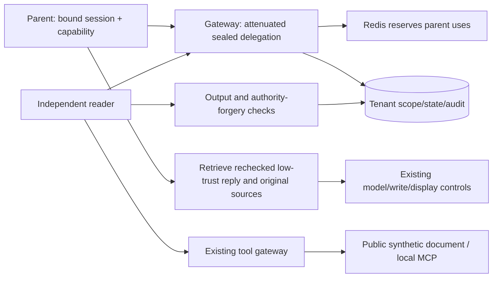

# Restricted Inter-Agent Delegation

[English](#) · [中文](../delegation.md)

The parent `demo-agent` delegates to a fixed independently authenticated `reader-agent`, with no model or writes. These can run as two local processes; this is not general orchestration, standard A2A, cross-host or transparent proxying.



The gateway decides, the collaborator sends HTTP proposals, and tools actually read. The collaborator neither imports tool implementations nor directly connects to MCP.

## Security rules: delegation-rules-v1

| Mechanism | Requirement | Limit |
| --- | --- | --- |
| Independent identity | Admin-created credential + `X-Agent-ID: reader-agent`; parent/child key substitution fails | Header alone is not identity |
| Attenuation | Valid parent binding/capability; two read tools, at most three public resources | No arbitrary registration/program/remote/writes/redelegation |
| Uses | Reserve 1–3 parent uses atomically in Redis, record child uses in SQL | No copying/refund on revoke/expiry/SQL failure; avoids double allocation |
| Parent budget | Parent direct proposals plus reserved child uses ≤ original 20 | Source limit 40 accommodates actual reads plus replies, not added tool authority |
| Time/current state | ≤300 seconds, no later than parent expiry; recheck capability, parent/child pause, identity generation, session/state | Cannot recall delivered data |
| Seal | HMAC binds tenant/parent/session/capability/child generation/session/tool/resources/uses/expiry/purpose/depth 1 | Integrity, not truth; no raw parent token in sealed message |
| Idempotency | Same request/call/summary content returns existing state; changes conflict | Blocked/revoked work cannot restart |
| Reply checks | ≤500 characters; exact completed charged source set; output and forged-authority checks | Can overblock quotes or miss paraphrases |
| Result seal | Display text/source/output-check seal reverified at parent retrieval, including current source level | Modified reply/reclassified sources not passed |
| Provenance | Parent receives actual child calls plus a separate delegation source | No invented parent calls or old egress reuse after sensitivity changes |

Reader identity can only use the delegation protocol, not ordinary tools/model/memory/output/session-create APIs. Administrators may pause its session. Data-flow/output versions are `data-flow-rules-v4` / `output-rules-v6`; existing private-answer/credential controls remain.

## Data and retention

Tenant tables: `worker_principals`, `delegations`, `delegation_calls`, `delegation_lab_runs`. Startup creates tables without fake historical delegation. State: created → running → completed/blocked; revoke and maintenance expiry are separate. Unknown/incomplete tools are neither completed summaries nor automatic retries.

Metadata mode still stores checked collaborator text as restricted operation data, masked by default and cleared after 30 days; IDs/seals/links/audit remain. No automatic long-term-memory generation from delegated sources. Delegation audit metadata is not sent to cloud Judge; original tool events still use their existing metadata Outbox. Parent and child process identity is not OS isolation.

## Interfaces

| Endpoint | Caller | Purpose |
| --- | --- | --- |
| `POST /api/v3/delegation-workers/reader-agent/credential` | Admin/CSRF | Create/rotate; old-generation delegations invalid |
| `POST /api/v3/delegation-workers/reader-agent/deactivate` | Admin/CSRF | Disable identity |
| `POST /api/v3/delegations` | Parent/binding/capability | Create attenuated task |
| `GET /api/v3/delegations/inbox` | Reader | Tenant inbox |
| `POST /api/v3/delegations/{id}/claim` | Reader | Sealed scope and gateway-created child session |
| `POST /api/v3/delegations/{id}/tool-calls` | Reader/child binding | Scoped read |
| `POST /api/v3/delegations/{id}/complete` | Reader | Checked summary and sources |
| `GET /api/v3/delegations/{id}/result` | Parent/binding | Rechecked low-trust reply |
| `POST /api/v3/delegations/{id}/revoke` | Admin/CSRF | Revoke |

Web `/dashboard/delegations`: Runtime analysis → Agent delegation. Manage independent credentials, inspect scopes/sessions/calls and revoke; research observation stays read-only. Credentials appear once only.

## Two-terminal demo

Create a reader credential in Web, and give the parent a short-lived `read_document` or `mcp_lookup_card` grant for `public-guide`. Keep keys in separate process environments, not arguments/model messages. Parent uses its existing `AGENT_API_KEY`, `AGENT_TENANT_ID`, `AGENT_CAPABILITIES_JSON`, `SENTRY_URL`:

```bash
uv run agentsentry-demo --scenario delegation
# Or the fixed local MCP read:
uv run agentsentry-demo --scenario delegation --delegation-tool mcp_lookup_card
```

Parent prints an ID and waits up to 180 seconds. In the reader terminal:

```bash
export AGENTSENTRY_READER_API_KEY='YOUR_INDEPENDENT_READER_CREDENTIAL'
export AGENT_TENANT_ID='default'
export GATEWAY_URL='http://127.0.0.1:8000'
uv run agentsentry-reader 'DELEGATION_UUID_FROM_PARENT'
```

The initial clients accept local HTTP gateway only. Parent holds no reader key; reader holds no parent key/token. This fixed demo starts no model and writes nothing to GitHub.

## Experiments and boundaries

```bash
.venv/bin/python -m agentsentry.delegation_lab --report /tmp/agentsentry-delegation-report.json
docker compose exec -T web python -m agentsentry.delegation_lab --report /tmp/agentsentry-delegation-report.json --persist
```

`delegation-lab-v1`: 22 boundary attacks/four controls, isolated SQLite and MCP doubles. Persist saves redacted summaries in the default configured tenant, not fixture call links. Actual MCP and PostgreSQL concurrency require separate checks. Facts include rejection basis, upstream reads, forbidden effects, audit and parent output; legitimate read counts are not dangerous writes.

Cross-host, generic delegation, writes/approval inheritance, multihop, multiple models, key custody, compromised-host direct tool access, semantic paraphrase and truth remain unverified. Database and application-key compromise together defeat HMAC. TH-015/ASI07 is partially verified, not all communication security solved. See [delegation cases](cases/delegation-boundaries.md) and [chapter 15](learning/15-delegation.md).
