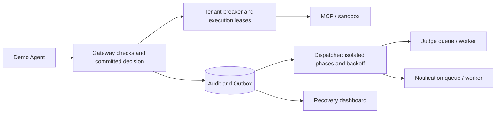

# Failure Propagation and Safe Recovery

[English](#) · [中文](../fault-propagation.md)

Failures may be accidental or adversarial, but must not bypass authorization, duplicate writes or turn uncertain results into success.



## Failure rules: resilience-rules-v1

| Failure | Response | Recovery |
| --- | --- | --- |
| Identity/capability Redis/check/audit commit | Deny or 503, no permissive fallback | Repeat required checks; query committed IDs |
| MCP/GitHub/sandbox dependency | After three consecutive failures, 30-second breaker; max two execution leases per tenant/dependency | One authorized half-open request after cooldown; success closes breaker |
| Judge/webhook | Provider/destination isolation, separate workers/queues, persistent exponential backoff, max three actual attempts | Admin can requeue terminal analysis/notification |
| Broker | Keep Outbox; first publish failure backs off remaining batch, max 20 per tenant/queue | Original-event delivery, never tool replay |
| Worker crash/late result | 120-second lease, random processing generation; stale generation cannot write back | Current generation continues, original Outbox dedup |
| Dispatched uncertain tool | Preserve unknown; interrupted execution over two minutes identified | Query/reconcile original effect, no auto-retry button |

Thresholds reflect local initial engineering scale, not OWASP requirements or calibrated production load. Legitimate not-found/business results do not open breakers. PostgreSQL tenant/dependency transaction locks coordinate leases and transitions; serial SQLite is not concurrency proof. Half-open is the next already-authorized real request, not an unrestricted probe. Busy/failed terminal IDs remain idempotent.

## Timeouts and shared domains

Capability Redis connection/read/write: two seconds. PostgreSQL connect/pool: three seconds; statements 15, lock waits five. Celery publishing disables automatic connection retry; tasks soft 60/hard 90 seconds. Existing shorter MCP/sandbox limits remain.

`/health` means responsive Web process; `/ready` checks DB/capability Redis and returns 503 without secret/address exposure. Judge downtime does not fail synchronous readiness. No worker heartbeat exists: empty queues/recent success cannot prove a worker is currently alive.

Separate notification workers prevent slow delivery occupying Judge slots. All still share host/Redis/PostgreSQL, and tenants share workers: limited isolation, not strict quotas/fairness. Webhooks remain at least once; receivers deduplicate `Idempotency-Key`. Generations cannot retract already sent HTTP.

## Web and drills

`/dashboard/resilience`: Administration → System and demo data → Failure isolation and recovery. Shows breakers, queues, age, events, unknown calls and lab reports. Login/CSRF is required for terminal analysis/notification retries; frozen Judge routes remain. There are no service-stop/fault-injection/daily-tool-replay buttons.

```bash
.venv/bin/python -m agentsentry.fault_lab --output /tmp/agentsentry-fault-lab.json
docker compose exec -T web python -m agentsentry.fault_lab --output /tmp/agentsentry-fault-lab.json --persist
docker compose exec -T web python - < scripts/check_resilience_postgres.py
docker compose exec -T web python - < scripts/check_resilience_queue.py
```

`fault-lab-v1` has 18 failures/four controls in temporary SQLite/doubles. Persist saves conclusions only; optional `--tenant` selects an existing tenant without changing policy. Compose DB host `db` requires container network. Temporary IDs are not daily links. PostgreSQL/queue scripts use temporary schemas, synthetic events, Mock and a dedicated worker, cleaning without stopping daily services.

Failure audit stores dependency/effect/error category/IDs/version, not raw exceptions or content, and is not recursively sent to Judge. A fully unavailable DB cannot save events but cannot permit uncommitted new execution. TH-014/ASI08 denotes clues, not confirmed attacks. Cross-Agent cascades, host exhaustion, long-term overload, strict quotas and all network combinations remain unverified. See [chapter 14](learning/14-fault-propagation.md) and [boundary cases](cases/boundary-validation.md).
