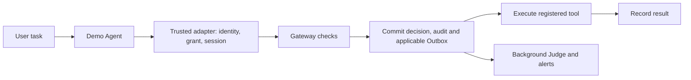

# 01 Security architecture and trust boundaries

[English](#) · [中文](../../learning/01-security-boundaries.md)

[Handbook](README.md) · [Next: 02](02-identity-capabilities.md)

> Before starting: use the [handbook environment](README.md#prerequisites-and-command-conventions), choose offline or online, and predict before running. Use temporary synthetic data. Online extensions also require services, a dedicated tenant, and valid credentials.

## Learning goals

Locate security decisions, actual execution, and asynchronous analysis. Distinguish trusted adapter code from untrusted material. Explain why a normal call and an audit failure demonstrate "record before execution."

## Threat and mechanism

A user asks to read a public document. Its author embeds instructions to read and send private data, or the model proposes another tool. Controlling document text does not provide administrator identity or tool authority.



The adapter constructs requests, attaches credentials, sends permitted model messages, and displays permitted output. The gateway independently verifies identity, arguments, resources, and conditions. Tools/MCP/sandbox produce effects. Judge cannot retroactively authorize an executed action.

Trusted means this code forms part of the enforcement boundary; it does not mean its process cannot be compromised. Models receive data and fixed definitions, not grant tokens.

## Code reading

Read [demo_agent.py](../../../src/agentsentry/demo_agent.py) for HTTP/MCP, sessions, model sending and display; [main.py](../../../src/agentsentry/main.py) for auth/tenant entries; [service.py](../../../src/agentsentry/service.py) for `submit_call`, `_execute_recorded`, and commit failures; [tools.py](../../../src/agentsentry/tools.py) for actual effects. Follow entry → decision commit → execution → result. See [architecture](../architecture.md).

## Exercise: successful execution versus failed audit commit

Offline temporary SQLite and in-memory Redis; no Compose/model/dashboard:

```bash
.venv/bin/python -m pytest -q tests/test_service.py::test_idempotency_and_exhaustion tests/test_service.py::test_audit_commit_failure_never_runs_tool
```

| Control | Evidence | Expected |
| --- | --- | --- |
| Authorized task, same request twice | Task row count and returned result | One task; replay returns existing result |
| Commit replaced with a failure | Task count after failed submission | 503, no task |

Read `bound()` and commit substitution in [tests](../../../tests/test_service.py). Assertions, not Judge scores, produce the pass. pytest owns temporary files; active policies and business databases are unchanged.

Optional: run read-public via [quick start](../../../README.md#quick-start) and follow its new session/call/Outbox. This creates new runtime evidence, not imported test data.

## Evidence, failure, and limits

Ask separately whether the gateway received the request, committed a decision, executed the tool, confirmed the result, and finished Judge. Completed tool plus pending Judge is possible. unknown means neither proven success nor proven failure.

Bypassing adapter/gateway bypasses these controls. Pre-execution commit tests do not prove every crash point has zero effects; post-dispatch uncertainty requires reconciliation.

## Self-check

1. Who sends an allowed model request? **The trusted adapter.**
2. Does a high Judge score prove unauthorized execution? **No: inspect effects and records.**
3. Are unrelated local programs intercepted? **No, only explicit integrations.**

Read [risk evidence](../risk-coverage.md) and [Chapter 12](12-audit-judge-mapping.md); fill the [record template](personal-assessment-template.md).
