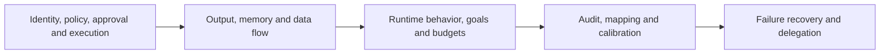

# AgentSentry Security Learning Handbook

[English](#) · [中文](../../learning/README.md)

Implementation baseline: V3.6 · Updated: 2026-10-01.

Start with your own installation and empty learning record. This handbook follows **threat → control → experiment → evidence → limits**. Every chapter includes a normal control, an attack or boundary exercise, code pointers and self-check questions. Passing a sample verifies its assertions; it neither certifies personal mastery nor resolves an entire threat category.

## Reading route



| Chapter | Topic |
| --- | --- |
| 01 | [Security architecture and trust boundaries](01-security-boundaries.md) |
| 02 | [Identity, tenants and least privilege](02-identity-capabilities.md) |
| 03 | [Tool policy and parameter boundaries](03-tool-policy.md) |
| 04 | [Human approval and approval deception](04-approval-safety.md) |
| 05 | [Sandbox and MCP execution boundaries](05-execution-boundaries.md) |
| 06 | [Prompt injection, provenance and output safety](06-input-output-safety.md) |
| 07 | [Long-term memory and storage poisoning](07-memory-security.md) |
| 08 | [Sensitive data flow and leakage prevention](08-sensitive-data-flow.md) |
| 09 | [Runtime detection and response](09-runtime-defense.md) |
| 10 | [Goal drift and task evidence](10-goal-drift.md) |
| 11 | [Session action chains and budgets](11-action-chain.md) |
| 12 | [Audit, Judge, alerts and threat mapping](12-audit-judge-mapping.md) |
| 13 | [Adversarial validation and rule calibration](13-validation-calibration.md) |
| 14 | [Failure propagation, circuit breakers and recovery](14-fault-propagation.md) |
| 15 | [Delegation identity, authority and result contamination](15-delegation.md) |

Read 01–15 in order for a first pass. With only an offline environment, start with each chapter’s offline exercises. For an alert investigation, begin with 12 and follow the evidence to the relevant topic. You need not complete every model or third-party experiment to understand the basic mechanisms.

## Your first exercise without a model

After installing dependencies and setting up the offline terminal below:

```bash
.venv/bin/python -m pytest -q tests/test_service.py::test_idempotency_and_exhaustion tests/test_service.py::test_audit_commit_failure_never_runs_tool
```

Predict whether a valid authorization executes only once, and whether a failed decision commit permits execution. Then inspect chapter 01’s assertions and code. No Docker or real model is required; results remain in the terminal rather than appearing in Web.

## Prerequisites and command conventions

Run commands from the repository root. Install with `uv sync --locked --extra test`, or reuse your existing `.venv`; do not overwrite an existing `.env`.

Most offline tests use temporary SQLite, in-memory Redis and controlled responses. MCP tests may launch a local stdio subprocess; remote-MCP tests may bind temporary loopback HTTPS/OAuth services. Permission to listen locally is required, but they do not require Docker or real third-party access.

Use a **separate offline terminal** and set process-only values:

```bash
export AGENTSENTRY_LEARNING_TMP="$(mktemp -d "${TMPDIR:-/tmp}/agentsentry-learning.XXXXXX")"
cp policies/default.yaml "$AGENTSENTRY_LEARNING_TMP/default.yaml"
export POLICY_PATH="$AGENTSENTRY_LEARNING_TMP/default.yaml"
export DATABASE_URL="sqlite:///$AGENTSENTRY_LEARNING_TMP/offline.db"
export MCP_DEMO_DIR="$AGENTSENTRY_LEARNING_TMP/mcp-data"
export ADMIN_PASSWORD='test-admin-password'
export SESSION_SECRET='testing-session-secret-at-least-32-characters'
export AGENT_API_KEY='testing-agent-secret-at-least-32-characters'
export JUDGE_PROVIDER=mock
export OUTPUT_LOCAL_MODEL_BASE_URL=''
export GOAL_LOCAL_MODEL_BASE_URL=''
export AGENTSENTRY_MEMORY_ENABLED=true
export AGENTSENTRY_RUNTIME_BINDING_REQUIRED=false
export AGENTSENTRY_GITHUB_MCP_ENABLED=false
export AGENTSENTRY_GITHUB_MCP_WRITE_ENABLED=false
export AGENTSENTRY_REMOTE_MCP_REGISTRY='{}'
export AGENTSENTRY_MODEL_REMOTE_DESTINATIONS='{}'
export WEBHOOK_URL=''
export WEBHOOK_SECRET=''
```

The temporary policy copy keeps generated tenant policies outside the repository. Runners with an explicit `--policy policies/default.yaml` still read that default file. These published dummy credentials are only for tests, never for a running service. Keep redacted reports if needed, remove your temporary directory when finished, and close the terminal. Do not run online or third-party scripts with these offline settings.

Open a different terminal for online work:

```bash
export SENTRY_URL='http://127.0.0.1:8000'
```

Replace the port with your deployment’s port. Research/admin runners generally use `Settings` and local `.env`; the standalone demo Agent reads its identity and capabilities from its process environment rather than automatically loading `.env`. Do not `source` the entire `.env` or copy credentials into notes.

Web exercises require running services, tenant login and tool policy. Real-model exercises additionally require the [local-model setup](../local-model.md) and registered destination. Judge credentials are not Agent-model credentials. Compatibility binding settings reproduce the default; they are not a secure-deployment recommendation. Sensitive writes and model egress still independently require valid binding.

## Where results live

| Experiment | Environment | Result | What it establishes |
| --- | --- | --- | --- |
| Offline test | Temporary database, client, doubles or subprocess | pytest and source assertions | Specified logic and boundaries |
| Offline corpus runner | Temporary database or direct rule functions | Terminal / chosen JSON | Fixed proposal and rule behavior |
| Online scripted lab | Research tenant and synthetic resources | Report and selected data tenant in Web | Integrated decisions and links |
| Local real-model lab | Same Agent path and local model | Report, sessions and calls | Observed model behavior and end-to-end effects |
| Third-party check | Registered MCP and separate credentials | Dated case and upstream reconciliation | That service/configuration at that time |

A temporary database’s `call_id` is not queryable in your running Web database. Synthetic sources can have dedicated experiment pages rather than ordinary call details. See the [experiment index](experiment-index.md). Labs initiate **new tests from fixed corpora**; they do not automatically copy or replay all daily business data. Some runners reuse a research tenant, others create a fresh one; follow the relevant chapter.

## How to study each chapter

1. Write the normal user goal, attacker goal and attacker-controlled input.
2. Predict the decision and actual effect before running controls and boundaries.
3. Trace tenant, session, call/check IDs. Separate decision, execution result and Judge signal.
4. Answer the self-checks and state a scenario the control does not cover.

| Notebook field | Record |
| --- | --- |
| Environment | Date, mode, corpus/hash, policy/rule revision, model name |
| Sample | Corpus version plus sample ID; normal and attacker goals |
| Facts | Dangerous proposal, actual model send, side effect, displayed contamination |
| Evidence | Data tenant, session/call/check IDs and report location |
| Conclusion | Verified, not attempted, pending, unknown, error or not run; scope |

Keep notes private by default. Do not attach credentials, business text or unbounded model answers. The handbook neither publishes rules, approves attacks nor starts third-party writes. Runners do not all support individual sample selection; absent such an option, they execute their fixed collection.

## Assessment and reference

- [Personal learning assessment](personal-assessment.md): 15 task cards, predictions, 30 foundational record units, hands-on practice and human review.
- [Record and summary template](personal-assessment-template.md): separate product outcomes from personal understanding.
- [Glossary](glossary.md) and [experiment index](experiment-index.md).
- [Advanced security cases](../cases/README.md).
- [Project plan](../../../PROJECT-PLAN.en.md), [architecture](../architecture.md), [risk evidence](../risk-coverage.md).

Completion means you can locate a check, run a normal and boundary case, find factual evidence and explain a limitation. Reading a chapter or counting tests is not a substitute for understanding. CLI output, synthetic source text and raw JSON remain in their original language; the English guides explain their fields and status semantics without changing experiment behavior.
