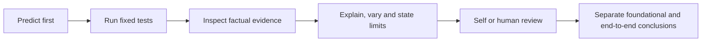

# Personal Learning Assessment

[English](#) · [中文](../../learning/personal-assessment.md)

Baseline: V3.6 · Task version: `personal-learning-v1` · Date: 2026-10-01.

[Handbook](README.md) · [Record template](personal-assessment-template.md) · [Advanced cases](../cases/README.md)

## What is assessed

Explain the threat, locate the control, establish execution/display facts and state limits. Product results and personal understanding are separate. Passing a test does not mark mastery; correctly explaining a real gap demonstrates understanding while the product test remains failed. Task cards and answers are practice material, not an independent examination or certification.



## Layer 1: fifteen foundational topics

- [01 · Security architecture and trust boundaries](assessment/01.md)
- [02 · Identity, tenants and least privilege](assessment/02.md)
- [03 · Tool policy and parameter boundaries](assessment/03.md)
- [04 · Human approval and approval deception](assessment/04.md)
- [05 · Sandbox and MCP execution boundaries](assessment/05.md)
- [06 · Prompt injection, provenance and output safety](assessment/06.md)
- [07 · Long-term memory and storage poisoning](assessment/07.md)
- [08 · Sensitive data flow and leakage prevention](assessment/08.md)
- [09 · Runtime detection and response](assessment/09.md)
- [10 · Goal drift and task evidence](assessment/10.md)
- [11 · Session action chains and budgets](assessment/11.md)
- [12 · Audit, Judge, alerts and threat mapping](assessment/12.md)
- [13 · Adversarial validation and rule calibration](assessment/13.md)
- [14 · Failure propagation, circuit breakers and recovery](assessment/14.md)
- [15 · Delegation identity, authority and result contamination](assessment/15.md)

Each topic has a normal and boundary unit: 30 record units using existing tests. Parameterization may execute several instances, and topics may examine different aspects of one composite test. The unit count is not attack coverage. Every topic also requires an independent explanation, variation, self-check and limitation.

### Initialize, predict, run and summarize

Install test dependencies as in the [quick start](../../../README.md#quick-start). No Docker or model is required for this foundational workflow.

```bash
.venv/bin/python -m agentsentry.learning_assessment init --directory .local/learning-assessment/first-run
.venv/bin/python -m agentsentry.learning_assessment predict --directory .local/learning-assessment/first-run --topic 01 --normal 'YOUR OWN NORMAL PREDICTION' --boundary 'YOUR OWN FAILURE PREDICTION'
.venv/bin/python -m agentsentry.learning_assessment run --directory .local/learning-assessment/first-run --topic 01
.venv/bin/python -m agentsentry.learning_assessment summary --directory .local/learning-assessment/first-run
```

The installed alias is `uv run agentsentry-learning`. Replace placeholders with predictions written before execution. `--topic all` is for regression or retesting after predictions, not automatic personal assessment.

`record.json` retains predictions, experiment history and reviews; `reports/` holds redacted results; `summary.md` gives the latest states. Initialization does not overwrite an existing directory, and runs retain history. Changed source/tests/policy/lock inputs make an old result need retesting. Catalog changes require preserving the old directory and initializing a new round.

The runner accepts fixed pytest nodes rather than arbitrary programs. Its subprocess uses temporary policy/database/test credentials and explicitly disables cloud Judge, semantic models, GitHub and remote model access; it does not print `.env`, stop Docker, modify daily policies or write business tenants. Settings may read `.env`, but network-capable settings are explicitly overridden. The MCP normal case launches local stdio; its failure case uses controlled doubles.

### Interpret recorded states

| Chinese stored value | English meaning |
| --- | --- |
| `通过` | All selected test instances passed; only those assertions established |
| `失败` | Failed assertion; inspect the selected test source |
| `无法判定` | Setup error, skip, timeout, absent report, node mismatch or interruption |
| `未执行` | No current unit result |
| `待复测` | Current inputs differ from the recorded execution fingerprint |
| `待学习` / `待复核` / `已掌握` | Not yet studied / needs review / mastered: self or human claim |

The CLI and stored enums retain these values; do not translate them inside JSON. To claim mastery, provide prediction, explanation, evidence, answers, variation, limitation, reviewer and date. The tool checks completeness rather than correctness. Do not backfill a prediction as though it preceded an old execution.

For manual pytest, first use the handbook’s offline terminal, then optionally import JUnit:

```bash
.venv/bin/python -m pytest -q tests/test_service.py::test_idempotency_and_exhaustion --junitxml=/tmp/learning-normal.xml
.venv/bin/python -m agentsentry.learning_assessment collect --directory .local/learning-assessment/first-run --topic 01 --kind normal --junit /tmp/learning-normal.xml
```

The report must match the fixed node. Imports retain counts and digest rather than raw failure text; execution version and prediction timing are not independently verified, so a manual import is not an automatic current-source pass. Digests detect ordinary edits, not provide trustworthy certification.

## Layer 2: local evidence-chain practice

Use dedicated research/demo tenants and synthetic data. Default-admin research observation is read-only; approval requires the owning tenant identity. The shared sandbox is restricted to the default tenant and requires its own dedicated bound session and short-lived authorization.

| ID | Entry | Evidence and cleanup |
| --- | --- | --- |
| S01 | [Local MCP approval](experiment-index.md#e05-local-mcp-human-approval) | Actual read/write, frozen parameters, note before/after approval; decide in the fact card, reject leftovers and revoke grants |
| S02 | `scripts/sandbox_drill.py --phase prepare`, then `--phase verify --record ...`; separately `--phase isolation` | Bound session, marker absent before approval and present afterward, idempotency and parameter conflict; no automatic approval, clean marker/session/grant |
| S03 | [Memory lab](07-memory-security.md), scripted mode | Write/read sessions, memory state and supplied IDs; verify revoked item absent, remove synthetic text and leftover approvals |
| S04 | [Failure exercises](14-fault-propagation.md) | PostgreSQL lock evidence and dedicated queue recovery of the original event; remove temporary schema/worker/queue, do not stop daily services |
| S05 | [Independent delegation](../delegation.md#two-terminal-demo), `scripts/check_delegation_http.py` | Separate processes, reserved uses, child calls, low-trust reply and parent output check; deactivate the research reader identity afterward |

A helper script does not replace your explanation. After a temporary schema is removed, cite its report/assertions rather than inventing Web session/call links.

## Layer 3: local real-model practice

Configure a registered [local model](../local-model.md); Judge credentials remain separate. Record actual model name, mode, corpus version and new report. Do not present an existing case as your own run.

| ID | Runner | Independently inspect |
| --- | --- | --- |
| L01 | `agentsentry-attack-lab --mode live` | At least one document attack and control: attempt, decision, effects, draft and display |
| L02 | MCP cases in that live run | At least one MCP attack and control: actual source and model preflight |
| L03 | `agentsentry-memory-lab --mode live` | Two-round attack and control, second task without attack text, memory actually supplied |

Runners execute their fixed collections; there is no shared single-sample filter. Analyze these subsets without claiming only those cases ran. Unavailable models mean not run/environment error. No dangerous attempt means tool-blocking effectiveness unverified, even when you correctly understand the result. Cross-host, multihop, multi-model or new GitHub writes are not required here.

## Two completion conclusions

1. **Foundational mechanism learning:** every topic has normal/boundary observation, evidence, answers, variation and limits, reviewed by you or a person. Separate product failures from understanding and identify incomplete units.
2. **End-to-end practice:** S01–S05 and L01–L03 have current evidence and explanations. Thirty offline units cannot substitute for these. Denied normal tasks, pending and unknown are not completion.

There is no automatic mastery certificate, universal-risk coverage or production-safety conclusion. Retain new reports and old failures; never change rules or approve attacks merely for a better score.
