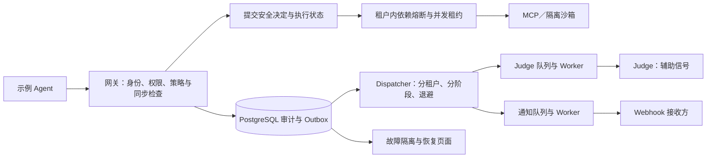

# 故障传播与安全恢复

[中文](#) · [English](en/fault-propagation.md)

本机制研究单个示例 Agent 所在服务链中的故障传播、过载和重试放大。故障不一定由攻击者造成，但不能使系统跳过授权、重复写入或把未知结果当作成功。



## 处置规则与依据

| 故障点 | 安全要求 | 当前处置 | 恢复方式 |
|---|---|---|---|
| 身份、权限 Redis、同步检查或审计提交 | 不能在缺少可靠安全决定时执行 | 拒绝新动作或返回 503；不使用宽松后备策略 | 依赖恢复后重新完成检查；已经提交的请求查询原 ID |
| 本地／远程 MCP、GitHub 固定适配器、沙箱 | 防止持续请求放大依赖故障 | 同租户、同依赖连续失败 3 次，暂停 30 秒；最多 2 个执行租约 | 冷却后只放行一次实际请求作半开探测，成功才关闭熔断；现有权限及来源检查继续有效 |
| Judge 提供方、Webhook 目的地 | 事后信号故障不能拖垮同步安全决定 | 分别按提供方＋目的地摘要隔离；使用独立队列及 Worker | 持久化指数退避，实际失败最多 3 次；管理员可重投终止的分析或通知 |
| Redis Broker | 审计不得依赖单次消息发布成功 | PostgreSQL 保留 Outbox；本批首次发布失败后其余记录退避，每租户每队列最多 20 条 | Broker 恢复后按原事件 ID 投递，不重放工具 |
| Worker 中断或迟到 | 重试不能被旧结果覆盖 | 120 秒租约及随机处理代次；旧代次不能写回；最多 3 次处理尝试 | 新代次可以继续分析，结果及告警仍按原 Outbox ID 去重 |
| 工具请求已发出但结果无法确认 | 不能推断没有发生副作用 | 保留 `unknown`；后台识别超过 2 分钟的中断执行 | 查询原 `call_id`，独立核对实际副作用；没有自动重试工具按钮 |

3 次、30 秒、2 个租约和每批 20 条是面向本机学习环境的初始工程参数，依据是现有依赖超时与进程规模，未经大型生产负载校准，也不是 OWASP 指定阈值。规则版本为 `resilience-rules-v1`；本版通过代码和测试修改，不提供在线放宽阈值。资源不存在等合法业务结果不触发依赖熔断。

依赖状态、执行租约、队列代次位于每个租户的数据库 schema。PostgreSQL 使用租户＋依赖的事务锁串行化名额分配和熔断转换；SQLite 只用于串行离线实验，不作为多进程并发保证。半开探测不是额外的自由调用：它是已经通过原有安全决定的下一次实际请求，写入仍须审批。失败或忙碌的工具调用具有终止状态，同一个 ID 重试只查询该结果。

## 超时与故障域

权限 Redis 连接与读写超时均为 2 秒；PostgreSQL 连接／池等待为 3 秒，语句超时 15 秒、锁等待 5 秒。Celery 发布关闭自动连接重试，任务软上限 60 秒、硬上限 90 秒。现有 MCP 与沙箱的更短请求超时继续生效。

`/health` 只说明 Web 进程可响应；`/ready` 检查数据库和权限 Redis，故障返回 503，不暴露地址或凭据。Judge 停机不会使同步授权的就绪检查失败。详细的熔断和异步状态只在管理员页面展示。服务没有实时心跳指标，因此不能把空队列或最近成功推断为 Worker 此刻存活。

Judge 与通知进程隔离后，一个缓慢通知不会占用 Judge 的执行槽。它们仍共用 Redis、PostgreSQL 和本机；多个租户仍共用 Worker。每批上限和租户内租约提供有限隔离，不构成严格的 CPU／内存配额或公平调度保证。

Webhook 的网络投递仍是至少一次：接收方必须按 `Idempotency-Key` 去重。处理代次防止数据库被旧结果覆盖，不能撤回已经发出的 HTTP 通知。

## 页面和运行命令

入口：**管理配置 → 系统与演示数据 → 故障隔离与恢复**，URL 为 `/dashboard/resilience`。展示当前租户的依赖状态、队列状态、待处理状态持续时间、故障与恢复事件、`unknown` 调用及固定实验报告。终止的 Judge 或通知记录可经现有管理员登录与 CSRF 校验重试；新尝试继续使用原事件绑定的 Judge 提供方。页面没有关闭服务、注入故障或重放日常任务的入口。

```bash
.venv/bin/python -m agentsentry.fault_lab --output /tmp/agentsentry-fault-lab.json
docker compose exec -T web python -m agentsentry.fault_lab --output /tmp/agentsentry-fault-lab.json --persist
```

默认只运行临时 SQLite 数据库和受控替身，不停用日常服务，不请求云端 Judge 或真实 GitHub。`--persist` 只把实验结论写入当前本机配置的数据库；可用 `--tenant` 明确指定已有租户，不修改其策略。实验内部临时 ID 不链接到日常工具详情。22 条固定样本采用 `fault-lab-v1:F01` 等唯一标识，其中 18 条故障、4 条正常对照；重复运行应得到相同逐例结论。

## 审计与框架关联

新故障事件只保存依赖 ID、处置、错误类别、关联 ID 和规则版本，不保存异常原文、请求内容、令牌或任务文本，也不再投给 Judge 形成故障递归。数据库完全不可用期间无法承诺写入故障事件，但不得发出没有已提交安全决定的新工具请求。历史错误原文不回写，页面默认遮盖。

威胁矩阵增加 `TH-014`，关联 OWASP `ASI08`；映射版本 `1.8.0` 将已提交的熔断及处理次数耗尽事件用作日常调查线索。没有核实攻击者行为时不强行填写 ATLAS 技术编号，故障命中不证明攻击成功。

## 验证与复现

固定替身、真实 PostgreSQL 并发、Redis 专属队列的事实与限制见[边界验证案例](cases/boundary-validation.md)。学习步骤见[故障传播章节](learning/14-fault-propagation.md)。Compose 配置的数据库主机 `db` 只在容器网络内可达；上面的 `--persist` 在 Web 容器中执行，不能直接照搬到未配置宿主数据库的终端。

现场检查：

```bash
docker compose exec -T web python - < scripts/check_resilience_postgres.py
docker compose exec -T web python - < scripts/check_resilience_queue.py
```

这两个脚本使用临时 schema、合成事件和 Mock Judge；队列脚本启动专属临时 Worker，结束后清理，不停止日常服务。

尚未覆盖跨 Agent 故障传播、真实第三方长期过载、主机耗尽、严格租户资源配额和所有网络异常组合。
