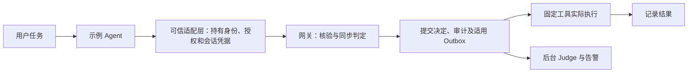

# 01 安全架构与信任边界

[中文](#) · [English](../en/learning/01-security-boundaries.md)

[手册首页](README.md) · 下一章：[身份与最小权限](02-identity-capabilities.md)

> 开始前：按[手册环境约定](README.md#前置条件与命令约定)安装依赖并选择离线／在线终端。先预测，再运行；仅执行临时合成数据实验。在线扩展另需服务、专用租户与有效凭据。

## 学习目标

- 找到安全判定、实际执行、异步分析三个位置。
- 区分可信适配代码与其处理的低信任材料。
- 从一条正常调用和一次审计故障解释“先留证，再执行”。

## 威胁场景与原理

用户要求阅读公开文档。攻击者可能把“读取私有资料并发送”等文字放进文档；模型也可能提出意料之外的工具。文档作者能够控制材料，不能因此取得管理员身份或工具授权。



适配层构造协议请求、附加凭据、发送获准模型消息、展示获准回答。网关独立核验身份、参数、资源和安全条件。工具／MCP／沙箱产生实际副作用。Worker 的 Judge 是事后信号，不会给已经执行的动作补发授权。

“可信”指项目把这段代码当作执行边界的一部分，并不表示运行它的进程永远不会失陷。模型能看到材料和固定工具定义，不能看到适配层持有的授权令牌。

## 项目实现与阅读顺序

| 入口 | 阅读内容 |
| --- | --- |
| [demo_agent.py](../../src/agentsentry/demo_agent.py) | 同一个 Agent 的 HTTP／MCP、会话上报、模型发送与展示路径 |
| [main.py](../../src/agentsentry/main.py) | HTTP 身份与管理入口、租户选择 |
| [service.py](../../src/agentsentry/service.py) | `submit_call`、`_execute_recorded`、审计失败行为 |
| [tools.py](../../src/agentsentry/tools.py) | 登记工具及模拟副作用 |
| [当前架构](../architecture.md) | 完整部署、信任边界与留存 |

按“调用入口 → 判定提交 → 执行 → 结果”读，不必先读完整个 `main.py`。

## 动手实验：正常执行与审计失败

**环境**：项目根目录、测试依赖；临时 SQLite 和内存 Redis。不启动 Compose，不使用模型，不进入 Web。

```bash
.venv/bin/python -m pytest -q tests/test_service.py::test_idempotency_and_exhaustion tests/test_service.py::test_audit_commit_failure_never_runs_tool
```

| 对照 | 测试核对的事实 | 预期 |
| --- | --- | --- |
| 正常且有授权的任务创建 | 同一请求提交两次，统计 Task 行 | 只创建一条；相同 call_id 返回原结果 |
| 判定提交时数据库不可用 | 测试替换 `commit` 并再次统计 Task 行 | 503，任务未创建 |

打开[测试源码](../../tests/test_service.py)看 `bound()`、两次提交、任务计数和 `commit` 替换。pytest 的“通过”来自这些断言，不是 Judge 评分。测试临时目录由 pytest 管理；不会修改运行中的策略或业务数据库。

**可选 Web 观察**：按[快速启动](../../README.zh-CN.md)运行 `read-public`，在“会话调查”和“工具调用与审计”用真实调用 ID 追踪决定、结果和 Outbox。这是新的运行记录，不是把上述测试数据库导入 Web。

## 证据核对、失败与局限

要分别问：请求是否进入网关？决定是否提交？工具是否实际执行？结果是否确认？Judge 是否完成？工具完成而 Judge 待处理是允许出现的状态；结果 unknown 不能推断成功或失败。

如果客户端完全不走适配层／网关，图中的控制不生效。审计故障实验验证的是执行前提交失败；不能由此推断所有崩溃时刻都没有副作用。执行后失联需要保留 unknown 并独立核实。

## 自检

1. 网关允许一次模型请求，谁实际向模型发送？**可信适配层**。
2. Judge 给出高分，是否说明工具曾越权执行？**不能，需要执行结果和存储证据**。
3. 同机其他程序直连工具，是否被自动拦截？**当前不保证，只覆盖显式接入路径**。

深入阅读：[风险证据](../risk-coverage.md)、[第 12 章](12-audit-judge-mapping.md)。完成后在[学习记录模板](personal-assessment-template.md)填一次预期与实际结果。
