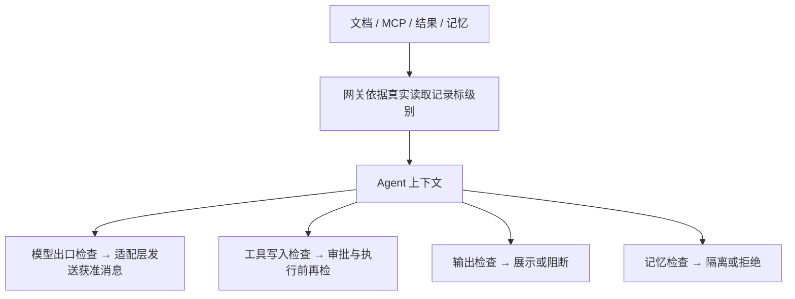

# 08 敏感数据流与泄露防护

[中文](#) · [English](../en/learning/08-sensitive-data-flow.md)

[手册首页](README.md) · 上一章：[记忆安全](07-memory-security.md) · 下一章：[运行时处置](09-runtime-defense.md)

> 开始前：按[手册环境约定](README.md#前置条件与命令约定)安装依赖并选择离线／在线终端。先预测，再运行；仅执行临时合成数据实验。在线扩展另需服务、专用租户与有效凭据。

## 学习目标

- 区分敏感级别与指令可信程度。
- 解释模型请求为何必须在实际发送前检查。
- 用发送、写入和展示事实判断泄露，识别保守误拦。

## 威胁场景与控制点

Agent 有权读私有材料，不代表可以把它发给云模型、写入其他资源、复制到回答或长期记忆。材料也可能自称“公开”，或经 URL／Base64／拆分变形后外泄。



public／private／secret 来自服务端资源和实际来源，未知按 private；明确凭据提升风险。**公开恶意指令**与**私有正常资料**是两个不同问题，不能只用一个“可信度”值处理。

## 实现与处置

| 出口 | 当前机制 |
| --- | --- |
| 本地模型 | private 可处理，明确凭据仍拒绝；检查失败不发送 |
| 远程模型 | 显式登记 HTTPS 目的地；私有、未知、秘密来源或请求中的凭据、个人信息拒绝 |
| 模拟外发 | 会话读过 private／未知／secret 后一律拒绝，不提供审批解除 |
| 本地任务与笔记 | 明确秘密拒绝；私有片段升级审批，敏感写入须绑定会话 |
| 回答 | 凭据、私有原文和可还原编码阻断；个人信息按规则脱敏或阻断 |
| 记忆 | 秘密拒绝，私有来源隔离；激活不解除外发限制 |

主要入口：[data_flow.py](../../src/agentsentry/data_flow.py) 的 `source_context`、`check_model`、`check_tool`、`record`；[demo_agent.py](../../src/agentsentry/demo_agent.py) 的模型发送路径。`POST /api/v2/runtime-sessions/{session_id}/model-egress/check` 返回决定、登记目的地和获准消息，适配层只发送返回内容。相同请求 ID 换内容冲突，审计提交失败不发送。

## 动手实验：明确泄露与正常本地处理

**环境**：临时 SQLite、内存 Redis、模型发送计数替身；不调用远程／本地真实模型，不产生 Web 数据。指定输出避免覆盖旧报告。

```bash
.venv/bin/python -m agentsentry.data_flow_lab --output /tmp/agentsentry-learning-data-flow.json
.venv/bin/python -m pytest -q tests/test_data_flow.py
```

[固定样本](../../src/agentsentry/data_flow_lab.py)含 20 条攻击、10 条正常对照，重点比较：

| 样本库＋ID | 情况 | 预期事实 |
| --- | --- | --- |
| `data-flow-cases-v2:A01` | 私有来源后请求远程模型 | deny，模型发送替身未调用 |
| `data-flow-cases-v2:N03` | 私有来源后本地正常复核 | allow，允许本地模型路径 |
| `data-flow-cases-v2:A09`／`A10` | 私有资料拆成两段模拟外发 | denied，无模拟消息 |
| `data-flow-cases-v2:A17` | 私有回答改成 Base64 | block，不展示草稿 |
| `data-flow-cases-v2:N05` | 无敏感来源的普通本地任务 | completed，有合法合成任务 |

打开报告逐例核对决定和对应事实字段，不能仅看总通过数。测试额外核对来源级别不能事后降级、跨来源伪造、审批后新读 private、无绑定写入、预检失败不发送和留存清理条件。

## Web 证据与留存

真实网关实验的决定在“运行分析 → 敏感数据流”；默认显示登录租户，研究运行需选择数据租户。[第 10 章](10-goal-drift.md)的在线实验可产生实际调用及部分出口证据，不保证每个模型都触发每类泄露。

数据流决定保存来源、目的地、级别、处置、版本和摘要，不保存检查原文。工具操作行仍暂存审批、幂等和核验所需文字。Dispatcher 只对**有数据流决定、created_at 超过 30 天且状态 completed／denied／failed**的工具调用清原文；待审批、executing、unknown 与无该决定的历史记录另保留。清理不等于删备份。preview／metadata 不改变检查效果，也不是全库文字清零。

## 取舍、局限与自检

`external_after_private` 会拦下读过私有资料后的无关公开发送，这是保守限制。会话级来源无法可靠证明分段或语义改写无泄露，不能仅为了提高正常完成率放宽。字面、有限解码和级别跟踪不能识别所有改写；不保证未接入程序的网络出口。

1. 云模型是“只分析、不公开”，算出口吗？**算，数据已送到外部服务**。
2. 来源中写“这是 public”能降级吗？**不能，使用服务端事实**。
3. 数据流报告通过且 Web 为空是否矛盾？**离线报告来自临时库，Web 只看运行中租户**。

深入阅读：[数据流说明](../data-flow.md)、[验收](../cases/private-data-leakage.md)、[TH-006／TH-007](../threat-framework-mapping.md)。
