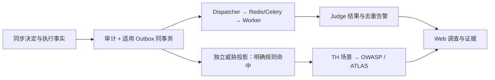

# 12 审计、Judge、告警与威胁映射

[中文](#) · [English](../en/learning/12-audit-judge-mapping.md)

[手册首页](README.md) · 上一章：[行动链](11-action-chain.md) · 下一章：[验证与校准](13-validation-calibration.md)

> 开始前：按[手册环境约定](README.md#前置条件与命令约定)安装依赖并选择离线／在线终端。先预测，再运行；仅执行临时合成数据实验。在线扩展另需服务、专用租户与有效凭据。

## 学习目标

- 从关联 ID 还原决定、执行、审计和异步处理。
- 解释 Judge 分数、标签、路由、失败与误报／漏报。
- 区分静态威胁证据与日常事件映射。

## 为什么要把事实和信号分开

工具是否执行是事实；Judge 是否认为可疑是模型信号；TH／OWASP／ATLAS 是风险分类。三者可能关联，不能互相替代。高分不证明攻击成功，低分不推翻确定性拒绝。



部分管理事件只保存审计，不进入 Judge，不能把它们没有 JudgeResult 记成丢失。非法身份／参数在业务调用建立前失败，也未必有完整业务审计链。

## 项目实现

| 组件 | 入口与核对点 |
| --- | --- |
| 事务审计 | [service.py](../../src/agentsentry/service.py)：`audit` 和决策提交；其他主题模块各自记录事件 |
| 投递与重试 | [dispatcher.py](../../src/agentsentry/dispatcher.py)：Broker 故障、待处理／失败状态 |
| 评判与去重 | [judge/worker.py](../../src/agentsentry/judge/worker.py)：JudgeResult、告警指纹、投递状态 |
| 提供方与路由 | [adapters.py](../../src/agentsentry/judge/adapters.py)、[runtime.py](../../src/agentsentry/judge/runtime.py)：固定事件路由和返回结构校验 |
| 威胁关联 | [threat_mapping.py](../../src/agentsentry/threat_mapping.py)、[映射 YAML](../threat-framework-map.yaml)：类型化命中和关联来源核验 |

租户切换 Judge 只影响新路由；已排队事件按原路由重试。Mock 是固定开发结果；OpenAI 兼容／DeepSeek 输出统一标签和分数；当前 Jev 按托管 API 的类型化结果映射，不是本地私有模型。

## 怎样理解分数

分数在 0～1，表达该提供方对**当前所收事件**的风险信号强度。必须同时看标签、模型版本、事件内容范围、处理状态和样本误报／漏报。不同提供方的值未必可直接比较，也没有经过本项目证明的攻击概率校准。

Worker 当前对非样本事件要求标签不为 none 且达到 `JUDGE_SCORE_THRESHOLD` 才生成 Judge 告警；缺省阈值 0.7。Jev 适配器内部的标签选择也使用自身映射阈值，两者职责不同。调整阈值会改变告警量，不能由此修改同步工具授权。

Judge 未收到最终回答时，不能把展示污染算作它的漏报。新核心审计只送必要元数据；历史事件与固定合成评测片段有各自脱敏路径。不要把“脱敏”当成零风险外发。

## 动手实验：正常评判、故障恢复和未知映射

**环境**：离线临时数据库和 HTTP／Broker 替身；不请求真实 Judge、不投递真实 Webhook、不进入运行中 Web。

```bash
.venv/bin/python -m pytest -q tests/test_dispatcher.py tests/test_judge.py tests/test_judge_adapters.py tests/test_judge_runtime.py tests/test_v15.py tests/test_threat_mapping_runtime.py
.venv/bin/python scripts/check_threat_mapping.py --check
```

| 对照／边界 | 核对证据 | 预期 |
| --- | --- | --- |
| 正常事件处理和重试 | JudgeResult、Outbox、告警数量 | 同事件不重复生成告警 |
| Broker／Webhook 替身失败后恢复 | 持久投递记录和重试状态 | 可重试、不谎报完成；接收方仍须去重 |
| 切换 Judge 后重试旧事件 | 保存的 provider／destination | 保持原路由，目的地漂移不得静默发送 |
| 明确命中与未知信号 | 事件／来源核验、映射版本 | 前者关联威胁，后者无匹配不硬贴标签 |

[映射测试](../../tests/test_threat_mapping_runtime.py)还核对同会话 MCP 来源、固定注入样本实际返回、新版本不改写已命中快照及租户隔离。[离线校验](../../scripts/check_threat_mapping.py)检查静态矩阵引用与生成文档一致，不依赖实时框架网站。

## Web 调查步骤

1. 在“告警”确认来源是 Judge 还是运行时／数据流规则。
2. 在“工具调用与审计”用 call_id 找决定、结果、审计、Outbox 和 Judge。
3. 查看所属会话的输出、来源、记忆和行动链，核对副作用／展示。
4. 在“运行分析 → 威胁关联”看事件证据和框架参考。未映射可能是无明确条件，待映射可能是积压；不能解释成无风险。

静态矩阵描述“场景、控制、已存测试和缺口”，实际事件列表描述“当前数据租户匹配的审计记录”。矩阵有测试证据而事件为空并不矛盾。

## 局限

没有明确条件的事件不自动关联威胁；已关联也不代表某个 ATLAS 技术已被确认实施，更不能作为整个 OWASP 类别解决的证明。投影失败不改变原安全决定；当前没有独立死信队列和完整容量背压。日志、应用与数据库同时失陷也超出当前证据可靠性保证。

## 自检

1. Judge 0.9 是否意味着 90% 已发生攻击？**不是，未校准的事件风险分数**。
2. 告警已确认是否等于工具已回滚？**不是，确认只是处理状态**。
3. TH-010 出现一次事件能否标供应链防护完成？**不能，要核对范围与专项证据**。

深入阅读：[Judge 设置](../judge-runtime-switch.md)、[日常映射](../runtime-threat-mapping.md)、[威胁矩阵](../threat-framework-mapping.md)。
