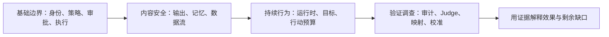

# AgentSentry 安全学习手册

[中文](#) · [English](../en/learning/README.md)

> 面向学习者：从自己的安装和空白记录开始。从主入口按主题学习，再用进阶案例对照实验；不分发原作者的数据库、凭据或个人掌握记录。

> 实现基线：V3.6；更新日期：2026-10-01。学习章节按安全主题排列，规则和样本版本以当前代码及实验报告为准。

本手册帮助你沿着“威胁 → 控制 → 实验 → 证据 → 局限”学习项目。每章都包含正常对照、攻击或边界实验、关键代码入口和自检。样本通过只证明指定断言成立；学习者还需自行解释、核对证据和完成复核，也不能据此认为整个威胁类别已被解决。

## 阅读路线



| 部分 | 章节 | 学习完成后应能做什么 |
| --- | --- | --- |
| 基础边界 | [01 安全架构与信任边界](01-security-boundaries.md) | 指出判定、实际执行和异步分析的位置 |
| 基础边界 | [02 身份、租户与最小权限](02-identity-capabilities.md) | 解释身份、工具授权、会话凭据的区别 |
| 基础边界 | [03 工具策略与参数边界](03-tool-policy.md) | 核对拒绝优先、资源范围、幂等和策略修订 |
| 基础边界 | [04 人工审批与审批欺骗](04-approval-safety.md) | 从事实卡证明批准的是原动作 |
| 基础边界 | [05 沙箱与 MCP 执行边界](05-execution-boundaries.md) | 区分授权、协议接入、执行隔离和结果核验 |
| 内容安全 | [06 提示词注入、来源与输出安全](06-input-output-safety.md) | 区分危险提案、草稿污染和展示污染 |
| 内容安全 | [07 长期记忆与存储污染](07-memory-security.md) | 跟踪污染跨会话传播和读取时再检查 |
| 内容安全 | [08 敏感数据流与泄露防护](08-sensitive-data-flow.md) | 核对模型、工具、回答、记忆四类出口 |
| 持续行为 | [09 运行时检测与处置](09-runtime-defense.md) | 解释规则证据、升级审批、暂停和恢复 |
| 持续行为 | [10 目标偏移与任务依据](10-goal-drift.md) | 解释自然语言线索为何不能替代授权 |
| 持续行为 | [11 会话行动链与行动预算](11-action-chain.md) | 验证额度、跨会话计数和资源探测暂停 |
| 验证调查 | [12 审计、Judge、告警与威胁映射](12-audit-judge-mapping.md) | 还原证据链，解释 Judge 分数和映射状态 |
| 验证调查 | [13 攻防验证与规则校准](13-validation-calibration.md) | 比较报告并判断规则调整是否有安全依据 |
| 故障安全 | [14 故障传播、熔断与恢复](14-fault-propagation.md) | 区分拒绝、退避、未知结果和可安全重试的操作 |
| 委托安全 | [15 Agent 间身份、权限与结果污染](15-delegation.md) | 验证权限衰减、独立身份、封签及低信任回复 |

**首次学习**按 01～15 阅读。**只用本机离线环境**先完成各章的离线测试和报告；需要 Web 或模型的扩展实验另行进行。**调查一条告警**先读 12，再沿证据进入相应主题。无需先完成所有真实模型或第三方实验才能学习基础机制。

## 不接模型的第一次练习

按下节安装依赖、设置离线终端后，运行：

```bash
.venv/bin/python -m pytest -q tests/test_service.py::test_idempotency_and_exhaustion tests/test_service.py::test_audit_commit_failure_never_runs_tool
```

先预测两种情况：授权有效时是否只执行一次？决定无法提交时是否会执行？然后读第 01 章的断言和代码。此练习无需 Docker 或真实模型；结果在终端，不进入 Web。

## 前置条件与命令约定

1. 在项目根目录执行命令。若已安装依赖，继续使用已有 `.venv`；新环境按[项目 README](../../README.zh-CN.md)安装 `uv sync --locked --extra test`。已有 `.env` 不覆盖。
2. 离线测试一般使用临时 SQLite、内存 Redis 和模拟响应，不要求启动 PostgreSQL、Redis 或真实模型。MCP 客户端测试可能启动本地 stdio 子进程，部分远程 MCP 测试还启动临时回环 HTTPS／OAuth 服务，需要允许本机监听端口；这不等于启动 Docker 服务或访问真实第三方。
3. 离线学习使用一个单独终端，可先设置下列**进程环境变量**，不会修改 `.env` 或运行中的服务。它们用于保持示例规则基线，避免可选语义服务、云 Judge 或外部接入参与离线实验：

   ```bash
   export AGENTSENTRY_LEARNING_TMP="$(mktemp -d "${TMPDIR:-/tmp}/agentsentry-learning.XXXXXX")"
   cp policies/default.yaml "$AGENTSENTRY_LEARNING_TMP/default.yaml"
   export POLICY_PATH="$AGENTSENTRY_LEARNING_TMP/default.yaml"
   export DATABASE_URL="sqlite:///$AGENTSENTRY_LEARNING_TMP/offline.db"
   export MCP_DEMO_DIR="$AGENTSENTRY_LEARNING_TMP/mcp-data"
   export ADMIN_PASSWORD='test-admin-password'
   export SESSION_SECRET='testing-session-secret-at-least-32-characters'
   export AGENT_API_KEY='testing-agent-secret-at-least-32-characters'
   export JUDGE_PROVIDER=mock
   export OUTPUT_LOCAL_MODEL_BASE_URL=''
   export GOAL_LOCAL_MODEL_BASE_URL=''
   export AGENTSENTRY_MEMORY_ENABLED=true
   export AGENTSENTRY_RUNTIME_BINDING_REQUIRED=false
   export AGENTSENTRY_GITHUB_MCP_ENABLED=false
   export AGENTSENTRY_GITHUB_MCP_WRITE_ENABLED=false
   export AGENTSENTRY_REMOTE_MCP_REGISTRY='{}'
   export AGENTSENTRY_MODEL_REMOTE_DESTINATIONS='{}'
   export WEBHOOK_URL=''
   export WEBHOOK_SECRET=''
   ```

   部分租户测试会按 POLICY_PATH 所在目录生成合成租户策略；上述临时副本让它们留在自己的临时目录，不向项目 policies 目录增加文件。运行器显式指定 `--policy policies/default.yaml` 时仍读取原始默认文件。这个临时目录仅用于离线学习，不作为运行中服务策略；示例测试凭据为公开假值，不用于实际服务。保留脱敏报告后，可删除本轮临时目录，退出该终端以结束进程配置。不要在这个终端执行在线或第三方脚本。

4. 在线实验另开终端，使用运行中网关的实际配置。下例仅指定本机访问地址：

   ```bash
   export SENTRY_URL='http://127.0.0.1:8000'
   ```

   若你的实际端口不同，替换示例中的 8000。研究运行器和管理脚本通过 `Settings` 读取本机 `.env`；独立示例 Agent 从进程环境读取身份和授权，不自动加载 `.env`。不要把整个 `.env` 用 `source` 载入终端，也不要复制凭据进学习笔记。
5. Web 实验需对应的服务运行、管理员登录和工具策略。真实模型实验还需按[本地模型配置](../local-model.md)核对发送进程、模型能力与网关登记目的地。Judge 密钥不能自动当作 Agent 模型密钥。

离线设置中的兼容模式用于复现当前缺省行为，不是安全部署建议。敏感写入与模型出口仍有各自的强制绑定要求；未绑定旧工具客户端不受行动链预算保护。

## 实验结果到底在哪里

| 类型 | 实际执行环境 | 结果位置 | 可以证明什么 |
| --- | --- | --- | --- |
| 离线测试 | 临时数据库、测试客户端、替身或本地子进程 | pytest 输出；断言和数据核对见测试源码 | 指定逻辑与固定边界 |
| 离线样本运行器 | 临时数据库或直接规则函数 | 终端／指定 JSON；不进入运行中 Web | 固定提案和规则表现 |
| 运行中网关的固定实验 | 研究租户、合成资源、真实网关记录 | 报告及指定数据租户的 Web | 已接入路径的决策与证据关联 |
| 本地真实模型实验 | 同一个示例 Agent、研究租户、本机模型 | 实验报告、关联会话和调用 | 模型实际行为及端到端结果 |
| 第三方现场实测 | 已登记的第三方 MCP、独立凭据 | 专项报告和上游核对 | 特定服务、配置和时间点 |

**临时实验里的 `call_id` 不能直接拿到运行中 Web 查询。**数据库不同；测试退出后记录通常已删除。合成来源链接也可能是实验专用证据页，并非真实网关调用。详见[实验索引](experiment-index.md)。

在线研究实验不会自动读取、复制或重放全部日常业务记录。运行器创建新的测试执行；不同运行器有“复用研究租户”和“每次新建研究租户”的区别，按各章说明操作。

## 每章怎样学

1. 先写下正常任务、攻击者目标和攻击者能控制的输入。
2. 预测安全决定与实际副作用，再运行正常对照和边界实验。
3. 按租户、会话、调用／检查 ID 核对证据；区分决定、执行结果和 Judge 信号。
4. 回答自检问题，再写出这项控制防不住的一个场景。

学习记录可保存在自己的笔记中，建议使用下表。不要附凭据、业务原文或自由模型回答全文。

| 项目 | 要填写的内容 |
| --- | --- |
| 环境与版本 | 日期、模式、样本版本／哈希、规则／策略修订、模型名 |
| 样本与预期 | 样本库版本＋样本 ID；正常目标、攻击目标、预期控制 |
| 观察事实 | 是否提出危险调用、是否发送模型请求、是否发生副作用、是否展示污染 |
| 关联证据 | 数据租户、session_id、call_id、检查 ID、报告位置 |
| 结论与限制 | 已验证、未尝试、待审批、unknown、环境故障或未执行；适用边界 |

本手册不自动调整规则、批准实验或执行第三方写入。进阶实验的副作用和恢复步骤在章节中说明。现有脚本不统一支持单样本选择，未提供参数的运行器按固定集合运行。

## 自检与验收入口

- [个人学习验收](personal-assessment.md)：15 张任务卡、运行前预测、30 个基础实验单元、本机与真实模型实操及人工掌握记录。
- [记录与总结模板](personal-assessment-template.md)：基础机制与端到端实操分别总结，产品结果与个人理解分开记录。
- [术语表](glossary.md)：容易混淆的概念和状态。
- [实验索引](experiment-index.md)：命令、结果位置、副作用与恢复。
- [进阶安全案例](../cases/README.md)：按安全问题理解缺口、修复证据与正常任务取舍。
- [当前总纲](../../AgentSentry%20整体项目方案.md)、[架构](../architecture.md)、[风险证据](../risk-coverage.md)：对照当前实现与注明边界的实验事实。

学习完成标准是：能解释检查位置、运行至少一个正常和一个边界实验、找到事实证据，并说出局限；不以读过章节或测试数量代替掌握程度。
