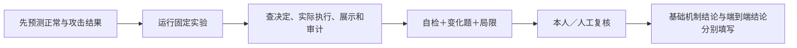

# AgentSentry 个人学习验收指南

[中文](#) · [English](../en/learning/personal-assessment.md)

基线：V3.6；任务版本：`personal-learning-v1`；日期：2026-10-01。

[学习手册](README.md) · [记录与总结模板](personal-assessment-template.md) · [进阶安全案例](../cases/README.md)

## 验收什么

个人学习验收要求你能解释威胁、指出控制位置、核对执行和展示事实、说明局限。产品测试结果与个人掌握分开记录：自动实验通过不自动标为掌握；发现并正确解释缺口可体现个人理解，产品实验仍保持失败。任务卡及已有答案是练习材料，不是独立考试或能力认证。



## 第一层：15 个基础主题

| 顺序 | 任务卡 | 正常／边界的主要事实 |
|---|---|---|
| 01 | [架构与信任边界](assessment/01.md) | 授权执行一次；决定提交失败零执行 |
| 02 | [身份、租户与最小权限](assessment/02.md) | 有效范围；越界、吊销 |
| 03 | [工具策略与参数边界](assessment/03.md) | 默认用例；候选策略漂移与未覆盖规则 |
| 04 | [人工审批与审批欺骗](assessment/04.md) | 原动作批准；事实卡、参数和确认边界 |
| 05 | [沙箱与 MCP 执行边界](assessment/05.md) | 正式本地 MCP；派发后 unknown |
| 06 | [提示注入、来源与输出](assessment/06.md) | 公开回答；A12 展示载荷阻断 |
| 07 | [长期记忆与存储污染](assessment/07.md) | 跨会话使用与撤销；篡改读取 |
| 08 | [敏感数据流](assessment/08.md) | 公开预检；失败后零模型发送 |
| 09 | [运行时检测与处置](assessment/09.md) | 正常读写；可疑读取后升级审批 |
| 10 | [目标偏移与任务依据](assessment/10.md) | 辅助线索不覆盖授权；来源伪造线索 |
| 11 | [行动链与预算](assessment/11.md) | 额度内幂等；跨会话与 unknown 预算 |
| 12 | [审计、Judge 与映射](assessment/12.md) | 去重告警；Broker 失败保留事件 |
| 13 | [攻防验证与规则校准](assessment/13.md) | 样本版本；正常私有任务摩擦 |
| 14 | [故障传播、熔断与恢复](assessment/14.md) | 局部故障不阻断正常读取；旧代次失效 |
| 15 | [Agent 委托安全](assessment/15.md) | 公开单跳；伪造批准摘要阻断 |

正常与边界共 30 个记录单元，复用已有测试。不同主题可引用同一复合测试的不同学习角度；参数化项可能执行多个测试，不把单元数解释为攻击覆盖率。每个主题还要求独立解释、变化题及局限。

### 初始化、预测、运行、查看

在项目根目录执行；先按[README](../../README.zh-CN.md#快速启动)安装带测试依赖的环境。此基础流程无需 Docker 或模型；已有环境不用重新安装：

```bash
.venv/bin/python -m agentsentry.learning_assessment init --directory .local/learning-assessment/first-run
.venv/bin/python -m agentsentry.learning_assessment predict --directory .local/learning-assessment/first-run --topic 01 --normal '填写自己的正常预测' --boundary '填写自己的故障预测'
.venv/bin/python -m agentsentry.learning_assessment run --directory .local/learning-assessment/first-run --topic 01
.venv/bin/python -m agentsentry.learning_assessment summary --directory .local/learning-assessment/first-run
```

安装后也可使用 `uv run agentsentry-learning`。不要照抄占位预测，应先自行作答。按主题逐次运行；`--topic all` 供实现回归或已填写预测后的批量复测，它不会帮你完成个人验收。

输出目录：`record.json` 保留预测、历次实验和人工复核；`reports/` 保存每轮脱敏实验结果；`summary.md` 汇总最新状态。文件为本机私有，不覆盖已有初始化目录，不覆盖历史实验。源码／测试／固定策略或锁文件变更后，旧报告标为“待复测”；任务目录变更需保留旧目录再初始化新轮次。

运行器只选择固定 pytest 节点，不接受任意程序或在线执行入口。子进程使用临时策略、数据库和测试凭据，关闭云 Judge、语义模型、GitHub 与远程模型开关；不加载或输出你的 `.env`。Settings 自身可能仍读取项目 `.env`，可联网设置均显式覆盖。不会停止 Docker 服务、修改日常策略或写入业务租户。第 05 章正常项启动本地 MCP stdio，故障项使用受控替身。

### 状态如何理解

| 实验状态 | 说明 |
|---|---|
| 通过 | 固定节点的全部实例通过，仅证明该测试断言 |
| 失败 | 有失败断言，保留问题，查节点源码进一步定位 |
| 无法判定 | 测试 setup 出错、跳过、超时、报告缺失、节点不匹配或进程中断 |
| 未执行 | 没有当前单元报告 |
| 待复测 | 当前源码等输入与运行时摘要不同 |

个人状态为“待学习／待复核／已掌握”，由本人或人工复核者填写。声明已掌握还需运行前预测、解释、证据、自检、变化题、局限、复核人和日期齐备；工具只检材料齐全，不判断内容正确。未记录预测的旧实验可重做，不能倒填成已有预测。

如果你自行运行任务卡的 pytest，先按[手册离线设置](README.md#前置条件与命令约定)准备单独终端，可输出 JUnit，再导入：

```bash
.venv/bin/python -m pytest -q tests/test_service.py::test_idempotency_and_exhaustion --junitxml=/tmp/learning-normal.xml
.venv/bin/python -m agentsentry.learning_assessment collect --directory .local/learning-assessment/first-run --topic 01 --kind normal --junit /tmp/learning-normal.xml
```

导入须匹配指定测试。只保存计数和报告摘要，不复制失败原文；运行版本及预测时序未核实，标明人工导入，不能自动计入当前源码通过数。报告哈希只检测普通修改，不构成可信认证。

## 第二层：本机证据链实操

使用独立研究／演示租户和合成数据。新建租户按现有 Web 管理入口操作，凭据只留本机。默认管理员跨研究租户观察为只读；人工批准需要所属租户身份。沙箱目前只供默认租户，需要新建专用会话和固定短时授权，不能扩展为其他租户共享执行权限。

| ID | 操作入口 | 必须保留的事实 | 收尾与通过条件 |
|---|---|---|---|
| S01 工具与审批 | [本地 MCP 演示](experiment-index.md#e05-本地-mcp-人工审批)：读取及 `mcp_demo.py --tenant ... --write` | 正式调用、冻结参数、审批前后笔记与原始调用状态 | 你在事实卡决定；拒绝／待审批不算正常写入完成。拒绝残留申请，吊销实验授权 |
| S02 当前沙箱 | `scripts/sandbox_drill.py --phase prepare` → Web 决定 → `--phase verify --record ...`；另跑 `--phase isolation` | 新会话绑定、审批前 marker 不存在、原动作批准后 marker 存在、同 ID 幂等、参数替换冲突 | 脚本绝不自动批准；核验后清 marker、结束会话和吊销授权。沙箱限制探针与网关链分别判定 |
| S03 跨会话记忆 | [记忆章节](07-memory-security.md)：`agentsentry-memory-lab --mode scripted`，按原章查看一个正常及攻击用例 | 写入／读取会话、记忆状态、实际读取 ID、撤销后的集合 | 用研究租户，不复制日常记忆；核对残留审批与合成文字，按原实验清理 |
| S04 故障恢复 | Compose 中运行 `scripts/check_resilience_postgres.py`、`scripts/check_resilience_queue.py` | PG 并发锁；专属队列无 Worker 时积压、恢复后一个原事件结果 | 只创建临时 schema、专属队列和临时 Worker，结束清理，不停日常服务 |
| S05 独立身份委托 | [双终端演示](../delegation.md#两个终端演示)；现场辅助脚本 `scripts/check_delegation_http.py` | 独立父子进程、额度预留、原始调用与低信任回复、父输出检查 | 正常文档和本地 MCP；攻击摘要被阻断。现场脚本保存新研究租户，最后停用协作身份 |

辅助脚本的执行证明不能代替你对证据的解释。临时 schema 已清理时只引用脚本报告和断言；不拼造 Web session／call 链接。

## 第三层：本地真实模型综合实操

先按现有[本地模型配置](../local-model.md)和各专题检查已登记本机模型。Judge 密钥不充当 Agent 模型凭据。记录实际模型名称、模式、样本版本及报告路径；不要把旧报告当作本轮运行。

| ID | 固定入口 | 本轮要独立核对 |
|---|---|---|
| L01 文档注入与正常对照 | `agentsentry-attack-lab --mode live`；[原章节与实验](06-input-output-safety.md) | 至少一条文档攻击及正常对照：危险尝试、决定、副作用、草稿与展示分别计 |
| L02 MCP 内容注入与正常对照 | 同一次本地 `attack-lab --mode live` 的 MCP 样本 | 至少一条 MCP 攻击及正常对照；确认正式来源 ID 和真实模型发送前决定 |
| L03 记忆跨会话 | `agentsentry-memory-lab --mode live`；[原章节](07-memory-security.md) | 至少一组两轮攻击及正常对照；第二轮任务不含攻击文本，核对记忆是否实际提供 |

现有运行器没有统一的单样本过滤开关，启动会运行其固定集合；你至少详细分析上述子集，报告不能声称只执行了这些子集。本机模型未启动时标未执行／环境故障。若模型没有危险尝试，工具阻断效果记“未验证”；你正确判断这一事实可以通过理解题。多模型协作、跨主机、远程攻击目标与新增 GitHub 写入不列为本轮必做。

## 两个完成结论

1. **基础机制学习**：15 个主题均有正常／边界观察、证据、自检、变化题和局限，由本人或人工复核后总结。产品失败与个人理解分开列；有未执行或无法判定实验时指出具体未完成项。
2. **端到端实操**：S01～S05 与 L01～L03 都有本轮证据及解释；未完成的任务明确列出，不由 30 个离线实验代替。拒绝正常任务与 pending／unknown 不算正常完成。

不会自动签发个人掌握、风险全覆盖或生产安全结论。每次补学保留新的报告，保留旧失败证据，不为成绩自动改规则、批准攻击或重放日常流量。
